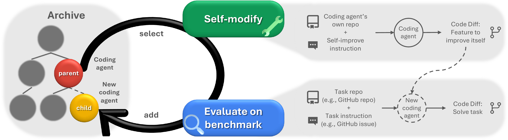

# Search Space

The search space in agent harness optimization is the set of harnesses that an optimizer can generate as update candidates. The **edit surface (the scope within which changes are allowed)** determines which candidates are possible.

For example, changing only the system prompt produces different candidates than changing the order of tool calls and retry behavior. The latter can fix more failures, but also makes search and evaluation harder.

## Three Levels of the Edit Surface

| Edit surface | What can be changed | Failures it mainly fixes | Examples |
|---|---|---|---|
| Prompt | instructions, demonstrations | insufficient instructions, insufficient examples, output format mismatches | DSPy, GEPA |
| Workflow (execution procedure) | tool order, branches, iteration, retries | decision order, missed checks, premature termination | AFlow |
| Harness implementation | tool interfaces, state management, memory, recovery | control that workflow editing alone cannot express | ADAS, DGM |

This is not a ranking. Moving down increases the freedom to make changes, but also expands what can break and the amount of evaluation required.

For example, the failure of "answering without checking tool results" can be fixed at all three levels.

- Prompt: Add an instruction to "check tool results before answering"
- Workflow: Define an order that permits answering only after tool execution
- Harness implementation: Add a validator that blocks the answer if a required tool call is missing

If the same failure can be fixed in multiple ways, start with the narrowest edit surface. Expand to the workflow or harness implementation only when a prompt cannot enforce the behavior.

## Changing the Prompt

DSPy holds the program structure fixed while selecting instructions and demonstrations to optimize an evaluation metric [@khattab2024dspy]. Its limited edit surface makes candidates easy to compare and the causes of failures easy to trace.

GEPA uses natural-language feedback on execution results to revise prompts and retains multiple candidates that perform well on different problems [@agrawal2026gepa]. Because it does not select a single candidate based only on average score, it can preserve candidates that fix one failure but not another.

If prompt changes can fix the problem, there is no need to expand the edit surface to the workflow or harness implementation. However, prompts alone are insufficient when the order of tool calls or retry conditions causes the problem.

## Changing the Workflow

AFlow represents the order, branching, and iteration of LLM and tool calls in code, then searches their combinations [@zhang2025aflow]. It can produce more behaviors than changing prompts alone, but the number of calls varies by candidate, so execution cost must be compared along with score.

{#fig-aflow-pareto fig-align="center" width="100%"}

*Source: Cost-performance figure from Zhang et al., “AFlow: Automating Agentic Workflow Generation” [@zhang2025aflow].*

Search cost and inference cost after acceptance should be reported separately.

## Changing the Harness Implementation

ADAS generates the entire agent system as Python code and stores evaluated candidates [@hu2025adas]. It can change prompts, tool use, and workflows at once, but a wide edit surface does not guarantee that a good candidate can be found with a limited evaluation budget.

In DGM, a coding agent modifies its own codebase and preserves a branching history of evaluated agents [@zhang2026dgm]. Rather than retaining only the current best candidate, this design preserves multiple modification paths.

{#fig-dgm-concept fig-align="center" width="100%"}

*Source: Figure 1 from Zhang et al., “Darwin Gödel Machine” [@zhang2026dgm].*

This is not a demonstration of unconstrained recursive self-improvement. The experiment modifies the code of a coding agent that uses a fixed foundation model and evaluates it on SWE-bench and Polyglot. It does not modify model training scripts.

## How Far to Expand the Edit Surface

Expanding the edit surface also increases risks such as breaking interfaces on rare paths, embedding shortcuts specific to validation tasks, and changing tool permissions. The principle is therefore to **start with the smallest edit surface that can fix the failure and expand it only when necessary**.

## Key Points

A larger search space is not inherently better. Search only the scope needed to fix the failure, proceeding from prompt to workflow to harness implementation.

## References {.unnumbered}
