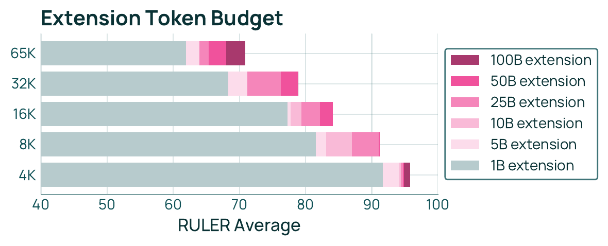

# Long-Context Extension

In Olmo 3, the base model (with an 8K token context length) was extended to support 65K tokens. This extension enables the model to handle long document understanding and complex tasks.

## Extension Overview

The long-context extension involved training at the following scale:

- **7B model**: Trained on 50B tokens
- **32B model**: Trained on 100B tokens
- **Context length**: Extended from 8K tokens to 65K tokens

This extension was achieved by combining a specific data mix (Dolma 3 Longmino Mix) with several technical methods.

## Dolma 3 Longmino Mix Composition

The dataset used for long-context extension consists of three major components (see Table 11 in the paper).

### 1. olmOCR PDFs

Long document data extracted from PDFs, categorized into various length buckets.

| Length Bucket | Documents | Tokens |
|--------------|-----------|--------|
| 8K-16K | 1,090,349 | 13.1B |
| 16K-32K | 508,354 | 11.0B |
| 32K-64K | 142,983 | 6.1B |
| 64K-128K | 54,992 | 4.5B |
| 128K-256K | 20,893 | 3.2B |
| 256K-512K | 8,130 | 2.4B |
| 512K-1M | 3,394 | 1.7B |
| 1M+ | 1,172 | 1.8B |

### 2. Synthetic Data

Synthetically generated data to strengthen long-context capabilities.

- **CWE (Common Word Extraction)**: 7.4B tokens
- **REX (Rewriting Expressions)**: 1.5B tokens

### 3. Midtraining Data Mix

66% of the data used during the midtraining phase is included to maintain general capabilities.

- **Midtraining data mix**: 34.9B tokens (66% share)

## Key Technical Components

Five technical components, illustrated in Figure 13 of the paper, are used to achieve long-context extension.

### 1. RoPE Extension (YaRN)

YaRN (Yet another RoPE extensioN) is adopted to extend RoPE (Rotary Position Embedding).

::: {.callout-note}
## Scope of YaRN Application

YaRN is applied **only to full attention layers**. For sliding window attention layers, the original RoPE settings are maintained.
:::

### 2. Document Packing

Multiple documents are packed into a single sequence for efficient training.

- **Method**: Best-fit packing algorithm
- **Purpose**: Efficient GPU memory utilization and improved training throughput

### 3. Intra-Document Masking

Intra-document masking is applied to prevent information leakage between packed documents.

::: {.callout-important}
## Importance of Masking

When using document packing, it is essential to mask attention so that it is not computed across different documents. This ensures that each document is processed independently.
:::

### 4. Model Souping

Multiple checkpoints are averaged to improve model stability and performance.

- **Method**: Averaging the weights of checkpoints saved at different training steps
- **Effect**: Obtaining a more generalizable and stable model

### 5. Token Budget

Allocating more tokens to the long-context extension phase leads to better performance.

- **7B model**: 50B tokens
- **32B model**: 100B tokens

@fig-longctx-token-budget shows the relationship between the extension token budget and the average RULER score at each context length. Just 1B tokens of extension nearly saturates the 4K–16K range, while reaching competitive performance at 32K and 65K requires roughly 10B–50B tokens of additional training. Ultimately, the 7B and 32B models are allocated 50B and 100B token budgets, respectively.

{#fig-longctx-token-budget}

## Synthetic Data Generation Pipeline

Two synthetic data generation methods are used to effectively improve long-context capabilities.

### CWE (Common Word Extraction)

This method generates tasks that extract words commonly appearing within a document. This enables the model to acquire the ability to reference the entire long document.

### REX (Rewriting Expressions)

REX uses 12 types of vignettes (short scenarios) to simulate various long-context tasks.

::: {.callout-tip}
## REX Vignettes

REX includes diverse task formats and generates synthetic data close to real use cases, such as summarization, information extraction, and question answering. This allows the model to adapt to a wide variety of long-context tasks.
:::

## Evaluation Results

The performance of the long-context extension model is evaluated using RULER (development suite) and HELMET (held-out evaluation), as shown in Table 12 of the paper.

### RULER Evaluation Results

RULER is a development evaluation suite that measures performance across various context lengths.

| Model | 4K | 8K | 16K | 32K | 64K | 128K | Average |
|-------|----|----|-----|-----|-----|------|---------|
| Olmo 3 7B | 92.7 | 91.7 | 88.1 | 82.5 | 70.3 | - | 85.1 |
| Olmo 3 32B | 95.8 | 94.9 | 92.8 | 89.4 | 82.1 | - | 91.0 |

### HELMET Evaluation Results

HELMET is a held-out evaluation set that closely reflects real-world use cases.

::: {.callout-note}
## Comparison with Other Models

The Olmo 3 long-context models demonstrate competitive performance compared to other open models of similar scale. In particular, the 32B model achieves high scores across many benchmarks.
:::

### Key Findings

The following insights were obtained from the long-context extension evaluation:

- **Effect of token budget**: Training with more tokens significantly improves long-context capabilities
- **Importance of synthetic data**: CWE and REX synthetic data contribute to performance improvement on real tasks
- **Effect of model souping**: Averaging multiple checkpoints yields stable performance

By combining these techniques, Olmo 3 effectively handles long contexts of up to 65K tokens.
