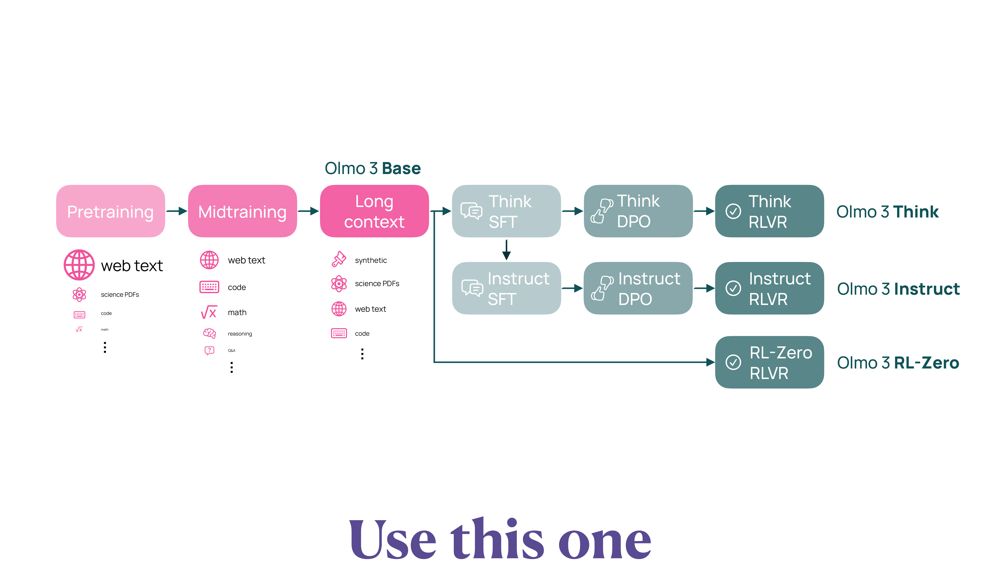

# Olmo 3 Technical Report Summary

## Overview

Olmo 3 is a family of state-of-the-art, fully-open language models at the 7B and 32B parameter scales developed by the Allen Institute for AI (AI2). This release includes the entire **Model Flow**, i.e., the full lifecycle of the family of models, including every stage, checkpoint, data point, and dependency used to build it.

**Key features**:

- **Fully open**: All training data, code, and intermediate checkpoints are publicly released
- **Diverse capabilities**: Long-context reasoning, function calling, coding, instruction following, general chat, and knowledge recall
- **Flagship model**: Olmo 3.1 Think 32B is the strongest fully-open reasoning model ever released

**Model variants**:

1. **Olmo 3 Base**: Foundation model (7B, 32B)
2. **Olmo 3 Think**: Reasoning model that performs step-by-step reasoning
3. **Olmo 3 Instruct**: Model that generates concise and direct responses
4. **Olmo 3 RL-Zero**: Model trained with Reinforcement Learning (RL) directly from the Base model

**Paper**: [arXiv:2512.13961](https://arxiv.org/abs/2512.13961)

## Model Flow

The development of Olmo 3 is divided into two major stages: **Base Model Training** and **Post-training**. The Base side has three phases (Pretraining → Midtraining → Long context), and the Post-training side branches from Base into three paths (Think / Instruct / RL-Zero).

{#fig-olmo3-model-flow}

## Base Model Training

### Stage 1: Pretraining

Olmo 3 Base is pretrained on **Dolma 3 Mix**, a diverse dataset of approximately 5.9 trillion tokens.

[→ Details:]{.detail-link} [Dolma 3 Dataset](dolma3-dataset.qmd)

**Key innovations**:

1. **Fast and scalable global deduplication**: A new tool for deduplication at the trillion-token scale

   [→ Details:]{.detail-link} [Deduplication](deduplication.qmd)

2. **olmOCR science PDFs**: A new data source converting academic PDFs to linearized plain text

   [→ Details:]{.detail-link} [olmOCR Science PDFs](olmocr-science-pdfs.qmd)

3. **New data mixing methods**: Token-constrained mixing and Quality-aware upsampling

   [→ Details:]{.detail-link} [Data Mixing Methods](data-mixing.qmd)

**Data sources**:

- Web pages
- Academic PDFs (olmOCR science PDFs)
- Code repositories
- Mathematical data
- Other diverse sources

### Stage 2: Midtraining

Midtraining is conducted on 100 billion tokens of **Dolma 3 Dolmino Mix**. The purpose of this stage is to enhance critical capabilities such as code, math, general knowledge QA, and more.

[→ Details:]{.detail-link} [Midtraining](midtraining.qmd)

**Innovative methods**:

1. **Two-part framework**:
   - Lightweight distributed feedback loops on individual data sources
   - Centralized integration tests to evaluate candidate mixes

2. **Priming for post-training**: Deliberately including instruction data and thinking traces to lay the groundwork for post-training

**Evaluation suite**: OlmoBaseEval

[→ Details:]{.detail-link} [OlmoBaseEval](olmobaseeval.qmd)

### Stage 3: Long-Context Extension

Olmo 3 supports long-context capabilities of up to **65K tokens**. The 7B model is trained on 50B tokens and the 32B model on 100B tokens of **Dolma 3 Longmino Mix**.

[→ Details:]{.detail-link} [Long-Context Extension](long-context-extension.qmd)

**Key techniques**:

- **Rotary Position Embedding (RoPE) extension**: Extending positional encoding using YaRN
- **Document packing**: Efficient placement of long documents using best-fit packing
- **Intra-document masking**: Attention only to tokens within the same document
- **Model souping**: Averaging multiple checkpoints

**Data source scale**:

- 8K+ tokens: 22.3M documents (640B tokens)
- 32K+ tokens: 4.5M documents (380B tokens)

This is the largest openly available collection for long-context research.

### Base Model Results

Olmo 3 Base is the **strongest fully-open model** at the 32B parameter scale:

- **Fully-open models**: Outperforms Stanford Marin 32B and Apertus 70B
- **Math and code**: Double-digit improvements over other fully-open 32B models
- **Long-context performance**: Comparable to Qwen 2.5 32B, Mistral Small 3.1 24B, and Gemma 3 27B

@fig-olmo3-flow-performance shows how scores accumulate across the model flow. Base Eval grows through Pretrain → Midtrain → Long Context, and Post-train Eval steadily improves across Supervised Fine-Tuning (SFT) → Direct Preference Optimization (DPO) → RL. Olmo 3 substantially outperforms other fully-open models (OLMo 2, Marin, Apertus); Base 32B matches Qwen 2.5 32B / Gemma 3 27B, and Post-trained 32B reaches Qwen 3 32B.

{#fig-olmo3-flow-performance}

## Post-Training

Three variants are developed from the Base model.

### Olmo 3 Think: Reasoning Model

Olmo 3 Think is trained to perform **step-by-step reasoning**, generating intermediate thinking traces before producing the final answer.

**Training pipeline**:

1. **SFT (Supervised Finetuning)**: Learning thinking traces with Dolci Think SFT
2. **DPO (Direct Preference Optimization)**: Preference alignment via Delta Learning

   [→ Details:]{.detail-link} [Delta Learning](delta-learning.qmd)

3. **RLVR (Reinforcement Learning with Verifiable Rewards)**: Reinforcement learning via OlmoRL

   [→ Details:]{.detail-link} [OlmoRL / GRPO](olmorl-grpo.qmd)

[→ Details:]{.detail-link} [Dolci Dataset](dolci-dataset.qmd)

**Results**:

- **Olmo 3.1 Think 32B**: The strongest fully-open reasoning model
- Outperforms Qwen 2.5 32B, Gemma 2/3 27B, and DeepSeek R1 32B
- Approaches the performance of Qwen 3 32B (with 1/6 of the training tokens)

**Key benchmark results** (Olmo 3.1 Think 32B):

| Category | Benchmark | Score |
|----------|-----------|-------|
| Math | MATH | 96.2 |
| Math | AIME 2024 | 80.6 |
| Reasoning | BigBenchHard | 88.6 |
| Reasoning | ZebraLogic | 80.1 |
| Coding | HumanEvalPlus | 91.5 |
| Coding | LiveCodeBench v3 | 83.3 |
| IF | IFEval | 93.8 |
| Knowledge | MMLU | 86.4 |

### Olmo 3 Instruct: Instruction-Following Model

Olmo 3 Instruct is trained to generate efficient and helpful responses without producing internal thinking traces.

**Features**:

- Concise and direct responses
- Optimized for function calling
- Low latency (no thinking traces)

**Training pipeline**:

1. **SFT**: Dolci Instruct SFT (including function-calling data)
2. **DPO**: Multi-turn preference data and response length optimization
3. **RLVR**: Further improvement of core capabilities

**Results**:

- Outperforms Qwen 2.5, Gemma 3, IBM Granite 3.3, and Llama 3 at comparable scales
- Narrows the performance gap with Qwen 3

### Olmo 3 RL-Zero: RL from Base

Olmo 3 RL-Zero is a model trained with RL directly from the Base model.

**Purpose**:

- Enables studying the impact of pretraining data on RL performance
- Provides a fully open RL benchmark

**Domains**:

- Math
- Code
- Precise IF (Instruction Following)
- General Mix

**Significance**:

- Existing open-weight models do not release their pretraining data, limiting RL research
- Olmo 3 RL-Zero enables clear benchmarking with the impact of data leakage eliminated

## Training Cost and Timeline

Training Olmo 3 Think 32B required approximately **56 days** using **1,024 H100 GPUs**.

**Breakdown**:

- **Pretraining**: ~47 days (including midtraining and long-context extension)
- **Post-training**: ~9 days (SFT, DPO, RL)

**Estimated cost**: ~**$2.75M** at $2/H100 hour

## Open Artifacts

Olmo 3 releases all intermediate checkpoints and final models.

**Released artifacts**:

1. **Models**:
   - Intermediate checkpoints at every stage
   - Final models (Base, Think, Instruct, RL-Zero)

2. **Data**:
   - **Data mixes**: The actual tokens used for training
   - **Source data pools**: Complete source data for each stage
     - Pretraining: 9T tokens of clean data
     - Midtraining: 2T tokens of specialized data
     - Long-context: 640B tokens of long-document data

3. **Sample mixes**: For experimentation with fewer compute resources
   - Pretraining: 150B tokens
   - Midtraining: 10B tokens

4. **Code**:
   - Training code: OLMo-core (pretraining), Open Instruct (post-training)
   - Data code: datamap-rs, duplodocus (deduplication), dolma3
   - Evaluation code: OLMES, decon (evaluation data decontamination)

## Key Contributions

1. **Fully open Model Flow**: All stages, data, and code are released
2. **Strongest fully-open model**: Best performance in both Base and Think
3. **New datasets**: Dolma 3 (pretraining) and Dolci (post-training)
4. **New methods**:
   - OlmoBaseEval (efficient Base model evaluation)
   - OlmoRL (efficient reinforcement learning framework)
   - Delta Learning (high-quality preference data creation)
   - Long-context extension techniques (RoPE, Document packing, Intra-document masking)
5. **Reproducibility**: Thinking chains can be traced back to original training data

## Summary

Olmo 3 is a comprehensive release designed to advance fully open AI research and development. It makes transparent not only the final model weights but the entire development process, enabling researchers to intervene and customize at every stage of model development.

**Core philosophy**: To truly advance open-source AI, it is necessary to make not just the final model but the entire "path" to it transparent and accessible.

**Flagship model**: Olmo 3.1 Think 32B approaches Qwen 3 32B on the reasoning benchmark suite while achieving this with 1/6 of the training tokens, with all training data and thinking chains fully traceable.
