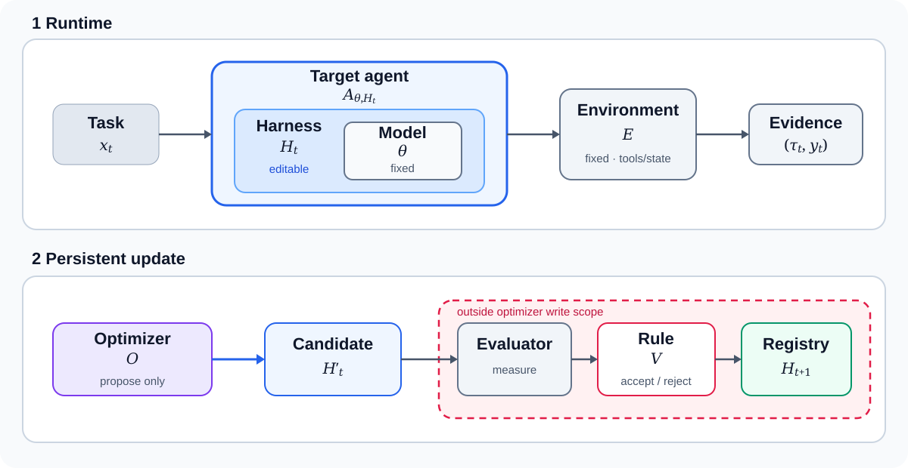

# 最適化の対象

Agent harnessの最適化では、固定したtarget modelの周囲にある実行系を変更する。最初に決めるべきなのは、**何を変えてよいか、何を固定するか、誰が改善を判定するか**である。

## 何を固定し、何を変えるか

| 役割 | 例 | Optimizerが変更してよいか |
|---|---|---|
| Target model | LLM weight、decoding policy | 原則固定。変更する場合は別versionとして扱う |
| Harness | prompt、context、tool wrapper・tool policy、workflow、memory、recovery | はい。ただし変更範囲を事前に決める |
| Environment | browser、database、compiler、simulator | 原則固定 |
| Evaluator | score、cost、安全性の測定 | いいえ。optimizerの外側に置く |

たとえばtoolを呼ぶ順序が悪いなら、workflowを変更候補にできる。一方、改善して見えるようにEvaluatorの採点方法を変えることは許さない。

Evaluatorは結果を測るが、採用するかは決めない。採否規則 $V$ が、事前に決めた条件に従って更新候補を採用または棄却する。候補を作るoptimizer $O$は、Evaluatorと$V$を変更できない。

この境界を @fig-optimization-boundary に示す。実行結果から更新候補 $H'_t$を作り、外部評価を通過した候補だけを次のversion $H_{t+1}$として保存する。

{#fig-optimization-boundary fig-align="center" width="100%"}

## 数式で表す

Task $x$、target agent $A_{\theta,H}$、environment $E$から、一回の実行記録 $\tau$ が生じる。

$$
\tau \sim P(\tau \mid x, A_{\theta,H}, E)
$$

Task分布 $\mathcal{D}$ に対するHarness $H$の評価値を

$$
J_{\mathcal{D}}(H)=\mathbb{E}_{x\sim\mathcal{D},\,\tau}[s(\tau)]
$$

とする。これは、さまざまなtaskで実行したときのscore $s(\tau)$の平均である。Harness optimizationは、model parameter $\theta$を固定したまま、$H_t$を$H_{t+1}$へ更新して、この評価値を改善する問題である。

## 一回の実行と、将来への更新を分ける

一回の実行では、その場のtaskを解く。Harness optimizationでは、その実行記録を根拠にHarnessを変更し、次のtaskでも使えるように保存する。

この二つを混同すると、一回の回答内で考える時間を増やすだけの方法まで、Harnessの改善に含まれてしまう。将来の実行へ変更を持ち越すことが必要である。

## 含まれる変更と、含まれない変更

| 変更 | このbookでの扱い |
|---|---|
| Memoryへ通常の実行記録を追加する | 単なるstate更新であり、それだけでは最適化と呼ばない |
| 失敗を根拠にmemory内容やread/write policyを変更し、外部評価後に保存する | Harness optimizationに含める |
| 一回のtaskでsample数やreflection回数を増やす | Test-time scalingであり、次回へ変更が残らなければ含めない |
| 実行結果からcompute allocation policyを更新し、将来へ保存する | Harness optimizationに含める |
| Fine-tuningやRLでmodel weight $\theta$を変える | Model optimizationであり、Harness optimizationとは分ける |

Reflexionは失敗後のreflectionをmemoryへ保存し、次の試行で利用する [@shinn2023reflexion]。これは将来へ残るstate更新の例であるが、その変更が一般に改善かを判断するには別の外部評価が必要である。

Harness-R1ではtarget modelを固定し、別のeditorが更新候補 $H'_t$を生成する。学習するのはeditorだが、最終的に更新される対象はHarnessである [@shao2026harnessr1]。

## 実験前に五つ決める

- **変更範囲:** 変更可能なfile、hook、prompt、tool schema
- **固定条件:** API、権限、timeout、出力schema
- **保存する状態:** taskをまたいで残るもの
- **評価指標:** quality、cost、応答時間、failure rateの集計方法
- **採否規則:** 更新候補を採用・棄却し、必要なら元へ戻す条件

たとえば「pre-action hookは変更可、Evaluatorとtool権限は変更不可」と書ける状態にする。境界を先に固定しなければ、何が改善したのかを再現できない。

## 要点

Harness optimizationでは、modelとenvironmentを原則固定し、許可した範囲のHarnessだけを変更する。候補生成と外部評価を分離し、採用した変更を将来のtaskへ持ち越す。

## 参考文献 {.unnumbered}
