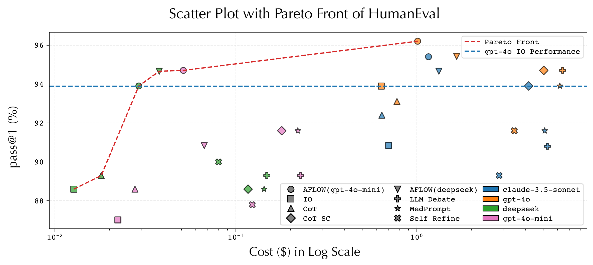

# 探索空間

Agent harnessの最適化における探索空間とは、optimizerが更新候補として生成できるharnessの集合である。実務上は、**edit surface（変更を許可する範囲）**を決めると、探索空間も決まる。

たとえば、system promptだけを変更する設定と、toolの呼び出し順やretryまで変更する設定では、作れる候補が異なる。後者は多くの失敗を直せる一方、探索と検証も難しくなる。

## 変更範囲を三段階で考える

| 変更範囲 | 変更できるもの | 主に直せる失敗 | 例 |
|---|---|---|---|
| Prompt | instruction、demonstration | 指示不足、例示不足、出力形式のずれ | DSPy、GEPA |
| Workflow（実行手順） | toolの順序、分岐、反復、retry | 判断の順序、確認漏れ、早すぎる終了 | AFlow |
| Harness implementation | tool interface、state管理、memory、recovery | workflow編集だけでは表現できない制御 | ADAS、DGM |

これは優劣の順ではない。下へ進むほど変更の自由度は増えるが、壊せる範囲と必要な評価量も増える。

たとえば「toolの結果を確認せずに回答する」という失敗は、三つの範囲で直せる。

- Prompt: 「toolの結果を確認してから回答する」という指示を加える
- Workflow: tool実行後にだけ回答へ進める順序を作る
- Harness implementation: 必要なtool callがなければ回答を止めるvalidatorを置く

同じ失敗を直せるなら、最も狭い変更から試す。Promptでは守れない場合に、workflowやharness implementationへ広げる。

## Promptを変える

DSPyは、programの構造を固定したまま、instructionやdemonstrationを評価指標に合わせて選ぶ [@khattab2024dspy]。変更箇所が限られるため、候補を比較しやすく、失敗時の原因も追いやすい。

GEPAは、実行結果への自然言語feedbackを使ってpromptを修正し、異なる問題に強い候補を複数残す [@agrawal2026gepa]。平均scoreだけで一本に絞らないため、ある失敗には効くが別の失敗には効かない候補も保持できる。

Promptの変更で直せるなら、workflowやharness implementationまで広げる必要はない。ただし、toolを呼ぶ順序やretry条件そのものが原因なら、promptだけでは不十分である。

## Workflowを変える

AFlowは、LLMやtoolを呼ぶ順序、分岐、反復をcodeで表し、その組み合わせを探索する [@zhang2025aflow]。Promptを変えるだけの場合より多くの動作を作れるが、候補ごとに呼び出し回数が変わるため、scoreだけでなく実行costも比較する必要がある。

{#fig-aflow-pareto fig-align="center" width="100%"}

*出典: Zhang et al., “AFlow: Automating Agentic Workflow Generation” [@zhang2025aflow] のcost–performance図。*

探索costと採用後のinference costは分けて報告すべきである。

## Harness implementationを変える

ADASはagent system全体をPython codeとして生成し、評価済みの候補を保存する [@hu2025adas]。Prompt、tool use、workflowを一度に変更できるが、変更可能な範囲が広いことは、限られた評価予算で良い候補を見つけられることを保証しない。

DGMではcoding agentが自分のcodebaseを変更し、評価済みagentの履歴を分岐させて残す [@zhang2026dgm]。現時点の最良候補だけを残すのではなく、複数の変更経路を保持する設計である。

{#fig-dgm-concept fig-align="center" width="100%"}

*出典: Zhang et al., “Darwin Gödel Machine” [@zhang2026dgm] のFigure 1。*

これは制約のない再帰的自己改善の実証ではない。固定したfoundation modelを使うcoding agentのcodeを変更し、SWE-benchとPolyglotで評価した実験である。Model training scriptは変更していない。

## どこまで広げるか

変更範囲を広げると、稀なpathでinterfaceを壊す、validation task専用のshortcutを埋め込む、tool permissionまで変えてしまう、といった危険も増える。したがって、**失敗を直せる最小のedit surfaceから始め、必要なときだけ広げる**のが原則である。

## 要点

探索空間は広いほど良いわけではない。Prompt、workflow、harness implementationの順に、失敗を直すために必要な範囲だけを探索する。

## 参考文献 {.unnumbered}
