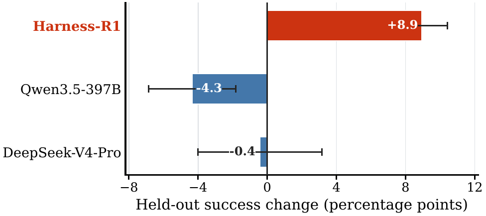

# 失敗から Harness を改善する

失敗したという結果だけでは、Harnessのどこを変えるべきか分からない。まず実行記録から**期待した状態との最初のずれ**を見つけ、原因仮説と小さな修正を作る。最初のずれは診断の起点であり、原因が確定したことを意味しない。

## Database queryの例

たとえば、誤ったdatabase tableを選んだ後にSQL syntax errorが出た場合、syntaxだけを直しても上流のずれは残る。Table選択を変えて再実行すれば、それが原因だったという仮説を検証できる。ただし、誤ったschema metadataなど、さらに上流の要因がないかも確認する。

@fig-failure-to-update は、最初のずれを見つけ、その直前のhookだけを修正し、修正前後を別の評価系で比較する流れを示す。

{#fig-failure-to-update fig-align="center" width="100%"}

実際にどの実行情報を保存し、最初のずれや類似failureをどうsignature化するかは、Part IIの[実行結果と失敗分析](execution-feedback.qmd)で扱う。

## 何を更新するか

失敗から得た情報の使い方には、少なくとも三つある。

- 次回に読むmemoryを更新する
- workflowの修正候補を作り、評価して選ぶ
- 修正候補を作るeditor自体を学習する

Reflexionは失敗後のreflectionをmemoryへ保存し、同じtask内の次の試行で読むcontextを変える [@shinn2023reflexion]。Model weightは変更しないが、独立した将来taskへ更新artifactを持ち越す評価ではない。

Harness-R1は、固定したtarget agentとは別にeditorを置く。Editorは失敗の記録を読み、事前に決めたhookだけを変更する [@shao2026harnessr1]。同じtask集合を修正前後で再実行し、その差からeditorを学習する。

著者報告では、WebShop、ALFWorld、DBBenchの平均成功率が44.3%から53.6%へ上昇した。差は9.3 percentage pointsである。ただし、観測済みtaskで修正を学ぶため、この結果だけでは未知のtaskにも効くとは言えない。

{#fig-harness-r1-heldout fig-align="center" width="75%"}

*出典: Shao et al., “Harness-R1” [@shao2026harnessr1] のheld-out-task analysis。*

@fig-harness-r1-heldout は、editorが大きければ良いわけではないことを示す。ただし、3 seedと限られたdomainによる結果であり、別のenvironmentやharness implementationへ一般化する証拠ではない。

## 修正できる範囲を制限する

Editorにrepository全体を自由に書き換えさせる必要はない。修正範囲を次のように制限する。

- hookごとに入力と出力の形式を固定する
- toolの権限を変更できなくする
- 壊れた修正は適用せず、元のHarnessへ戻す
- 対象の失敗だけでなく、既存の成功も再実行する
- 修正、根拠となる実行記録、評価結果を一緒に保存する

狭い修正で足りなければ、検証できる範囲を一つずつ増やす。

## 要点

失敗からの改善では、実行記録を保存し、最初のずれから原因仮説を作り、最小の修正で反証する。Editorを学習する場合でも、修正の採否はeditorの外側で決める。
