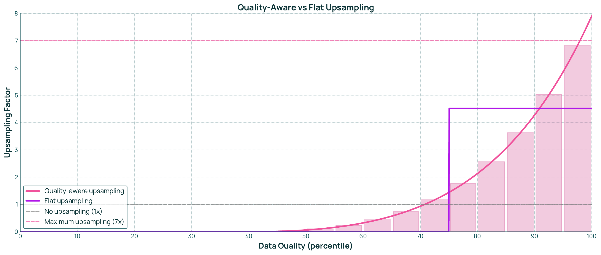

# データミキシング

## 概要

Data Mixing（データミキシング）は、複数のデータソースを最適な比率で組み合わせ、モデルの性能を最大化する手法である。Dolma 3 では、9T トークンのデータプールから 6T トークンの訓練ミックスを構成するために、Token-constrained Mixing と Quality-aware Upsampling という 2 つの革新的な手法を導入した。これらの手法により、限られたトークン予算の下で最適なデータ配分を実現している。

## データミキシングの目的

### トークン予算の制約

モデル訓練には、トークン予算という制約が存在する:

- **計算コスト**: 訓練に使用できるトークン数は、計算リソースによって制限される
- **最適配分の必要性**: 限られた予算内で、どのデータソースをどの程度含めるかを決定する必要がある
- **多様性と品質のバランス**: データの多様性を保ちながら、高品質なデータを優先する

### 最適な混合比率の決定

9T トークンのデータプールから 6T トークンの訓練ミックスを構成する際、以下の要素を考慮する:

- **データソースの特性**: Web テキスト、学術 PDF、コード、数学など、各ソースの特徴
- **トピックのバランス**: STEM、ソフトウェア開発、一般知識など、トピックの最適な配分
- **品質の考慮**: 高品質な文書を優先的に選択

## Token-constrained Mixing

Token-constrained Mixing は、トークン予算の制約下で最適なデータミックスを決定する手法である。

### Swarm-based Methods

小規模プロキシモデルを多数訓練し、その結果から最適なミックスを推定する:

**手順**:

1. **Swarm 構築**: 異なるミキシング比率で多数の小型プロキシモデルを訓練
2. **タスクごとの回帰**: 各プロキシモデルがミキシング重みをタスク性能にマッピング
3. **ミックス最適化**: 平均タスク BPB（bits-per-byte）を最小化するミキシングを発見

**利点**:

- **計算効率**: 小規模モデルでの実験により、大規模モデルの訓練前に最適なミックスを推定可能
- **並列化**: 複数のプロキシモデルを並列に訓練できる
- **反復的改善**: 結果に基づいて段階的にミックスを改善可能

::: {.callout-note}
## Swarm の規模

Dolma 3 では、1B パラメータモデルを多数訓練し、異なるミキシング比率での性能を評価した。これらのプロキシモデルは、5x Chinchilla（通常の 5 倍のトークン数）で訓練され、データミックスの効果を正確に測定する。
:::

### 条件付きミキシング（Conditional Mixing）

データソースの継続的な改善に対応するため、条件付きミキシング手順を採用する:

**特徴**:

- **柔軟性**: データソースが更新されても、ミックス全体を再計算する必要がない
- **モジュール性**: 個別のデータソースを独立して改善可能
- **スケーラビリティ**: 新しいデータソースの追加が容易

**開発サイクルへの対応**:

- データソースの継続的な改善
- 新しいデータソースの段階的な導入
- ミックス比率の動的な調整

## Quality-aware Upsampling

Quality-aware Upsampling は、重複排除後のクリーンなデータセットに対して、高品質文書を選択的に再導入する手法である。

### 重複の選択的導入

重複排除により削除されたデータの中から、高品質な文書を選択的に復元する:

**アプローチ**:

- **重複排除の基盤**: まず、すべての重複を削除したクリーンなデータセットを構築
- **品質評価**: 各文書の品質スコアを計算
- **選択的アップサンプリング**: 高品質な文書を選択的に繰り返す

**効果**:

- **品質の向上**: 高品質データの割合を増やすことで、モデルの性能を向上
- **効率的な繰り返し**: 全体的な繰り返しを最小限に抑えながら、高品質データに繰り返しを集中
- **トークン効率**: 限られたトークン予算を高品質データに優先配分

::: {.callout-tip}
## Quality-aware Upsampling の戦略

重複排除により削除された文書の中には、高品質なものも含まれる。これらを選択的に復元することで、重複排除による品質低下を防ぎつつ、データセット全体の品質を向上させることができる。
:::

## Topic と Quality による分類

Dolma 3 では、Web テキストをトピックと品質の両方の軸で分類し、きめ細かなミキシングを実現している。

### WebOrganizer による 24 トピック分類

WebOrganizer は、Web テキストを 24 の主要なトピックに分類するツールである:

**主要トピック（例）**:

- Science, Math, and Technology
- Software Development
- Arts and Entertainment
- Business and Finance
- Health and Medicine
- Education
- News and Current Events
- その他 17 トピック

**分類の利点**:

- **トピックごとの重み付け**: 各トピックに最適な重みを割り当てる
- **STEM の強化**: Science, Math, Technology などのトピックを優先的に配分
- **バランスの取れたミックス**: 特定のトピックに偏らないように調整

### fastText 品質分類器

各トピック内で、品質スコアによりさらに分類する:

**品質分類**:

- **20 の品質階層**: 各トピックを 20 の品質ティアに分割
- **fastText ベースの分類器**: 高速かつ正確な品質推定
- **客観的な品質指標**: 一貫性のある品質評価を実現

### 480 個のサブセット

24 トピック × 20 品質ティア = 480 個のサブセットに分割:

**きめ細かなミキシング**:

- **サブセットごとの重み**: 各サブセットに個別の重みを割り当て
- **品質とトピックの両立**: 高品質かつ重要なトピックを優先
- **柔軟な調整**: 細かい粒度でのデータ配分の最適化

各トピックを 20 ティアに分割した上で、@fig-quality-aware-upsampling のように品質ティアごとに繰り返し倍率を変える。低品質ティアはほぼ 1 倍に抑え、高品質ティアでは最大 7 倍まで指数的に繰り返すため、平均上限を 1 倍に保ったまま高品質サブセットだけが訓練中に多く現れる。

{#fig-quality-aware-upsampling}

## 混合戦略の結果

Token-constrained Mixing と Quality-aware Upsampling により、データソースの最適な比率が決定された。

### トピック別の重み（Figure 9a）

Web テキストのトピック分布において、以下の傾向が観察される:

**優先されたトピック**:

- **Science, Math, and Technology**: STEM ドメインを大幅にアップウェイト
- **Software Development**: プログラミングとソフトウェア開発を強化
- **Education**: 教育的コンテンツの重視

**抑制されたトピック**:

- エンターテインメント関連のトピック
- 一般的なニュースやソーシャルメディアコンテンツ

**結果**:

- 1B パラメータモデルで 5x Chinchilla の訓練を行った結果、平均 0.056 BPB の改善を達成
- 54 タスク中 13 タスクでのみ性能低下が見られ、最大でも 0.035 BPB の低下に留まる

### DCLM Baseline との比較（Figure 9b）

DCLM（DataComp for Language Models）Baseline と比較して、以下の改善が確認された:

**改善点**:

- **STEM タスク**: 科学、数学、技術関連のタスクで大幅な性能向上
- **コーディングタスク**: プログラミング能力の向上
- **一般知識**: 幅広い知識タスクでの性能改善

**トレードオフ**:

- 一部のタスクでは若干の性能低下
- 全体として、重要なタスクでの性能向上が優先される

::: {.callout-important}
## データミキシングの影響

データミキシングの最適化は、モデルの性能に大きな影響を与える。STEM ドメインを優先することで、科学的・技術的タスクでの性能が向上し、Olmo 3 の強みとなる。
:::

### Stack-Edu のプログラミング言語分布

コードデータにおいても、プログラミング言語別の最適なミックスが決定された:

**優先された言語**:

- **Python**: 最も高い重み付け（機械学習、データサイエンスでの重要性）
- **JavaScript/TypeScript**: Web 開発の主要言語
- **C++/Rust**: システムプログラミング言語

**抑制された言語**:

- Java: 相対的に低い重み（冗長性の高いコードが多い）
- Markdown: ドキュメントファイルの制限

**結果**:

- ほぼすべてのコーディングベンチマークで改善を達成
- Python 中心のタスクで特に顕著な改善

## まとめ

Data Mixing は、Dolma 3 の品質を決定する重要なプロセスである。Token-constrained Mixing と Quality-aware Upsampling という 2 つの革新的な手法により、限られたトークン予算の下で最適なデータ配分を実現している。

**主な特徴**:

- **Token-constrained Mixing**: Swarm-based methods による最適化
- **Quality-aware Upsampling**: 高品質データの選択的再導入
- **480 個のサブセット**: トピックと品質による細かい分類
- **条件付きミキシング**: データソースの継続的改善に対応
- **実証された改善**: DCLM Baseline と比較して平均 0.056 BPB の改善

これらの手法により、Dolma 3 は Olmo 3 Base モデルの高い性能を支える基盤となる。
