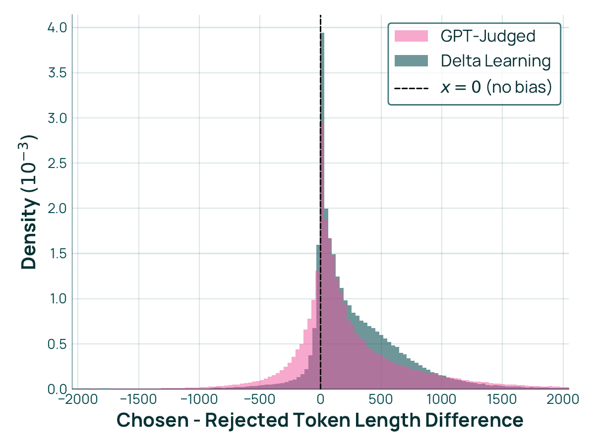

# Delta Learning

Delta Learning は、Preference tuning（選好調整）における新しいアプローチである。本手法は、SFT（Supervised Fine-Tuning）モデルと Base モデルの「差分」を活用することで、高品質な contrastive data を生成し、DPO（Direct Preference Optimization）の効果を最大化する。

## 基本原理

Delta Learning の核心は、モデル間の能力差を明示的に捉えることにある。

| 要素       | 能力                              |
|------------|-----------------------------------|
| Base Model | 限定的な推論能力                  |
| SFT Model  | 強化された推論能力                |
| Delta      | 「獲得された」推論能力            |

この Delta を preference optimization によって増幅することが目的である。

### モデル間の差分

SFT モデルは、Base モデルに対して以下の能力を獲得している。

- より構造化された推論プロセス
- 段階的な問題解決アプローチ
- タスク固有の知識の適用

Delta Learning は、この「獲得された能力」を優先応答（Preferred response）の生成に活用する。

## Dolci Think DPO での適用

Dolci Think では、Delta Learning を用いて推論能力の向上を図る（Section 4.3）。

### 合成データの生成

合成 preference pair は以下の手順で生成される。

1. 訓練セットから質問をサンプリングする。
2. SFT モデルで応答を生成する（Preferred）。
3. Base モデルで応答を生成する（Dispreferred）。
4. 品質フィルタリングを適用する。

### Preferred vs Dispreferred の作成

**Preferred 応答**:

- Dolci Think SFT モデルで生成
- 段階的推論プロセスを含む
- 最終的な正答に到達

**Dispreferred 応答**:

- OLMo2 7B Base モデルで生成
- 推論の深さが不足
- 誤った結論または不完全な推論

### 品質フィルタリング

生成されたペアに対して、以下の基準でフィルタリングを実施する。

- Preferred 応答が正答を含む
- Dispreferred 応答が誤答または不完全
- 両応答間に明確な品質差が存在

この結果、約 1M の高品質な preference pair が作成された。

## Dolci Instruct DPO での適用

Dolci Instruct では、Delta Learning を multi-turn 対話の最適化に使用する（Section 5.3）。

### Multi-turn Preference Data

データソースは約 500K の multi-turn プロンプトであり、以下の対で構成される。

- **Preferred**: Dolci Instruct SFT で生成。簡潔で構造化された応答。
- **Dispreferred**: OLMo2 7B Base で生成。冗長または構造化されていない応答。

### 応答長の最適化

Delta Learning により、以下の改善が実現される。

- **簡潔さの維持**: 不要な冗長性を排除
- **情報密度の向上**: 重要な情報を効率的に伝達
- **構造の改善**: 論理的な流れを持つ応答

@fig-delta-learning-length-bias に、chosen と rejected の応答長差（トークン数）の分布を示す。GPT-Judged で構築した選好データは chosen 側が大きく長くなる方向に偏っており、DPO 後の応答が冗長化しやすい。一方、Delta Learning で構築したデータは長さ差の分布が x = 0 周辺に対称的に近づいており、応答長そのものではなく内容の品質差を学習させやすい構造になっている。

{#fig-delta-learning-length-bias}

### 実装の詳細

約 500K の multi-turn プロンプトから preference pair を生成し、応答品質の向上を図る。

## 効果と利点

Delta Learning による Preference tuning は、複数の利点をもたらす。

### SFT を超える性能

DPO による追加の最適化により、SFT 単独では到達できない性能レベルを実現する。

| ステージ               | 推論の状態                                  |
|------------------------|---------------------------------------------|
| Base Model             | 限定的な推論                                |
| SFT Model              | 強化された推論                              |
| DPO Model (with Delta) | 最適化された推論と選好アライメント          |

### RL への準備（Priming for RL）

Delta Learning による DPO は、将来の Reinforcement Learning の基盤となる。

- **報酬モデルとの整合性**: 人間の選好との alignment を改善
- **探索の効率化**: より良い初期方策を提供
- **安定性の向上**: RL 訓練の収束を促進

### 推論能力の向上

Dolci Think での適用により、以下の改善が確認された。

- 複雑な問題に対する段階的アプローチの強化
- 推論の深さと正確性の向上
- 推論フロンティアの拡大

::: {.callout-note}
## 他の Preference Tuning 手法との比較

**従来の DPO**:

- 人間によるラベル付けデータを使用
- データ収集のコストが高い
- スケールに限界がある

**RLHF (Reinforcement Learning from Human Feedback)**:

- 報酬モデルの訓練が必要
- 複雑な実装と調整が必要
- 計算コストが高い

**Delta Learning の利点**:

- **スケーラビリティ**: 合成データにより大規模な訓練が可能
- **コスト効率**: 人間のアノテーションが不要
- **品質保証**: モデル間の能力差により、明確な contrastive signal を生成
- **柔軟性**: 異なるタスクやドメインに容易に適用可能

Delta Learning は、SFT で獲得した能力を最大限に活用し、効率的かつ効果的な preference tuning を実現する。
:::

## まとめ

Delta Learning は、OLMo2 3B の preference tuning において中心的な役割を果たす。

**主要なポイント**:

- SFT モデルと Base モデルの差分を活用
- 高品質な contrastive data を自動生成
- 推論能力と応答品質の両面で性能向上
- スケーラブルで cost-effective な手法

この手法により、Dolci Think と Dolci Instruct は、それぞれの領域で最先端の性能を達成している。
