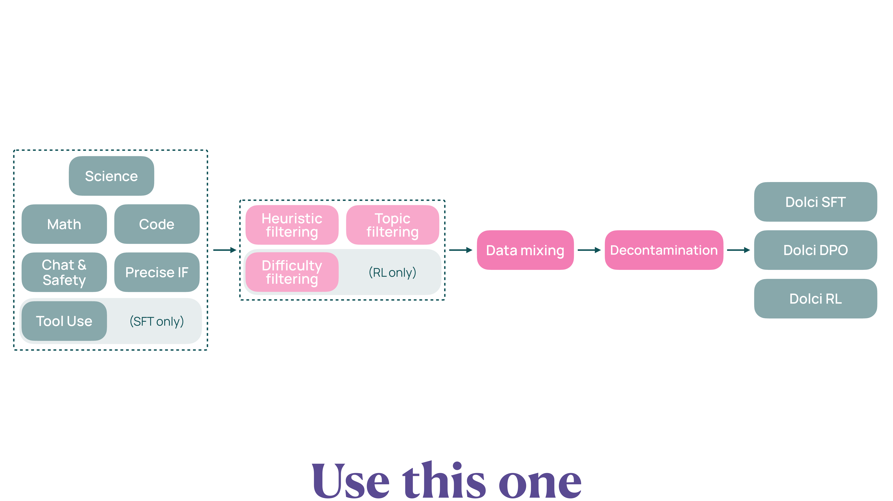

# Dolci

Dolci (Dolma Instruct) は、Olmo 3 の Post-training（後訓練）に使用される包括的なデータスイートである。Think（思考型）、Instruct（指示追従型）、RL-Zero（Base から直接強化学習（Reinforcement Learning, RL））という 3 つの異なるモデルバリエーションをサポートするため、複数のサブセットから構成されている。

## 概要と目的

Dolci は、Olmo 3 Base モデルを特定のタスクに特化させるための高品質なデータセットである。事前学習で獲得した幅広い知識を、実用的な能力（数学的推論、コーディング、指示追従、チャット）に変換することを目的としている。

**Dolci の主な特徴**:

- **完全オープン**: すべてのデータソースとキュレーションパイプラインを公開
- **高品質**: モデル生成データの厳格なフィルタリングと検証
- **多様なドメイン**: Math, Code, Chat, Instruction Following, Safety をカバー
- **段階的訓練**: Supervised Fine-Tuning（SFT）、Direct Preference Optimization（DPO）、RL の各ステージに最適化されたデータ

## 3 つのサブセット {#sec-dolci-subsets}

Dolci は、3 つの主要なサブセットから構成されている。各サブセットがどの訓練ステージにどれだけのサンプルを持つかを @tbl-dolci-suite にまとめる。

| サブセット | SFT | DPO | RL |
|-----------|-----|-----|----|
| Dolci Think | Think SFT（1.94M samples） | Think DPO（187K pairs） | Think RL（40K prompts） |
| Dolci Instruct | Instruct SFT（544K samples） | Instruct DPO（105K pairs） | Instruct RL（128K prompts） |
| Dolci RL-Zero | — | — | Math / Code / 指示追従（Instruction Following, IF） / General Mix（各 30K prompts、計 120K） |

: Dolci Data Suite の 3 サブセットと、それぞれの SFT・DPO・RL ステージのデータ規模 {#tbl-dolci-suite}

各サブセットは、異なるモデルバリエーションの訓練パイプラインに対応している。

**Dolci Think**: 段階的推論を行う思考型モデル用

**Dolci Instruct**: 簡潔で直接的な応答を生成するモデル用

**Dolci RL-Zero**: Base モデルから直接 RL で訓練するモデル用

## Dolci Think: 思考型モデルのデータ {#sec-dolci-think}

Dolci Think は、最終回答を生成する前に段階的推論を行う思考型モデル（Olmo 3 Think）を訓練するためのデータセットである。

### Dolci Think SFT: 合成思考トレース

**規模**: 約 194 万サンプル

**目的**: モデルに思考トレースを生成する能力を教える

**データソースの構成**:

| カテゴリ | 主なソース | サンプル数 |
|---------|-----------|-----------|
| Math | OpenThoughts3+, SYNTHETIC-2-Verified | 約 85 万 |
| Code | OpenThoughts3+, Dolci Think Python Algorithms | 約 55 万 |
| Chat & IF | WildChat, Persona IF, OpenAssistant | 約 45 万 |
| Safety | CoCoNot, WildGuardMix, WildJailbreak | 約 9 万 |
| その他 | Aya, TableGPT | 約 10 万 |

: Dolci Think SFT のデータソース構成 {#tbl-dolci-think-sft}

**データ生成手法**:

Dolci Think SFT のデータは、既存のプロンプトに対して強力なモデルで思考トレースを生成することで作成されている。

**使用モデル**:

- **Math / Code**: QwQ-32B（思考型モデル）
- **Chat / Safety**: DeepSeek R1（推論特化モデル）

**フィルタリング基準**:

- 不完全な思考トレース（途中で打ち切られたもの）を削除
- ドメイン固有エラー（数式の誤り、コード構文エラー）を削除
- 過度の繰り返しや冗長性を削除
- OpenAI taxonomy を使用したトピックフィルタリング

### Dolci Think DPO: Delta Learning による選好データ

**規模**: 約 18.7 万ペア

**目的**: 思考トレースの品質を向上させる

**Delta Learning の原理**:

DPO（Direct Preference Optimization）で重要なのは、選択（chosen）と棄却（rejected）の「品質差（デルタ）」である。Dolci Think DPO では、強いモデルと弱いモデルのペアを使用して、明確な品質差を持つ選好データを作成している。

**データ生成設定**:

| 役割 | モデル |
|-----|--------|
| Chosen (選択) | Qwen 3 32B (thinking mode) |
| Rejected (棄却) | Qwen 3 0.6B (thinking mode) |

: Delta Learning のモデルペア {#tbl-delta-learning-think}

**主要な知見**:

SFT では改善しないデータでも、DPO では大幅に改善可能である。

- Qwen3-32B の出力で SFT すると性能低下
- 同じデータを弱いモデルとペアにして DPO すると大幅改善

これは、「絶対的な品質」よりも「相対的な品質差」が学習に重要であることを示している。

### Dolci Think RL: 挑戦的なプロンプト

**規模**: 約 4 万プロンプト

**目的**: RLVR（Reinforcement Learning with Verifiable Rewards）による性能向上

**特徴**:

Dolci Think RL は、思考型モデルが苦手とする挑戦的なプロンプトを集めたデータセットである。

**ドメイン**:

- **Math**: AIME（アメリカ数学招待試験）レベルの高難度問題
- **Code**: LiveCodeBench などの実践的プログラミング課題
- **Reasoning**: ZebraLogic などの論理パズル

## Dolci Instruct: 指示追従型モデルのデータ {#sec-dolci-instruct}

Dolci Instruct は、思考トレースを生成せずに、簡潔で直接的な応答を生成するモデル（Olmo 3 Instruct）を訓練するためのデータセットである。

### Dolci Instruct SFT: Function-calling 対応データ

**規模**: 約 54.4 万サンプル

**目的**: 効率的で有用な応答を生成する能力を教える

**主要なデータソース**:

- **Tulu 3 SFT**: 多様な指示追従タスク
- **Function-calling データ**: ツール使用と API 呼び出しのサンプル
- **Flan**: タスクフォーマット学習データ

**Dolci Think SFT との違い**:

| 項目 | Dolci Think SFT | Dolci Instruct SFT |
|-----|----------------|-------------------|
| 思考トレース | あり | なし |
| 応答スタイル | 段階的推論 | 簡潔・直接的 |
| Function-calling | なし | あり |
| サンプル数 | 194 万 | 54.4 万 |

: Think と Instruct の SFT データの比較 {#tbl-think-vs-instruct-sft}

### Dolci Instruct DPO: 応答長の最適化

**規模**: 約 10.5 万ペア

**目的**: 簡潔性とユーザビリティの向上

**主要な改善点**:

**Multi-turn preferences（複数ターン選好データ）**:

合成会話を生成し、複数ターンにわたる一貫した応答を学習する。

**Length control（応答長制御）**:

Chosen と Rejected の長さ差を 100 トークン以下に制限することで、冗長性を抑えている。

- モデルが単に「長い応答」を学習するのを防ぐ
- ユーザビリティを重視した簡潔な応答を促進

### Dolci Instruct RL: コア能力の改善

**規模**: 約 12.8 万プロンプト

**目的**: RLVR による核心能力のさらなる向上

**ドメイン分布**:

- **Instruction Following**: 複雑な指示の正確な追従
- **Chat**: 多様な会話シナリオへの対応
- **Function-calling**: ツール使用の精度向上
- **Knowledge Recall**: 知識の正確な想起

## Dolci RL-Zero: Base から直接 RL {#sec-dolci-rl-zero}

Dolci RL-Zero は、Base モデルから SFT/DPO を経由せずに、直接 RL で訓練するための特別なデータセットである。

### 目的と重要性

**研究的価値**:

- 事前学習データが RL パフォーマンスに与える影響を研究可能
- 完全にオープンな RL ベンチマークを提供

**既存の課題**:

従来のオープンウェイトモデル（Llama 3、Qwen 2.5 など）は事前学習データを公開していないため、RL 研究が制限されていた。

Dolci RL-Zero により、データリークの影響を排除した明確なベンチマークが可能になる。

### 4 つのドメイン

Dolci RL-Zero は、4 つの異なるドメインで構成されている。

**Math（数学）**:

- **規模**: 3 万プロンプト
- **タスク**: GSM8K、MATH などの数学的推論問題
- **検証方法**: SymPy による数式比較

**Code（コーディング）**:

- **規模**: 3 万プロンプト
- **タスク**: HumanEvalPlus、LiveCodeBench などのプログラミング課題
- **検証方法**: テストケースの実行と検証

**IF（Instruction Following）**:

- **規模**: 3 万プロンプト
- **タスク**: IFEval、IFBench などの精密な指示追従
- **検証方法**: 制約チェック関数による検証

**General Mix（一般混合）**:

- **規模**: 3 万プロンプト
- **タスク**: 上記 3 つのドメインと Chat の混合
- **検証方法**: ドメインに応じた検証方法

### Decontamination（評価データ汚染除去）

Dolci RL-Zero の全データは、評価ベンチマークとの重複を排除するため、厳格な Decontamination 処理が施されている。

**手法**: decon パッケージによる 2 フェーズ処理

1. **検出フェーズ**: 8-gram マッチングで重複を検出（閾値 50%）
2. **クラスタ拡張フェーズ**: 類似サンプルのクラスタ全体を除去

これにより、RL 訓練データとベンチマークデータの完全な分離を保証している。

## データキュレーションパイプライン {#sec-dolci-pipeline}

Dolci のデータキュレーションは、@fig-dolci-pipeline に示すパイプラインで実施される。Science / Math / Code / Chat & Safety / Precise IF / Tool Use の各ドメインから素材を集め、ヒューリスティック・トピックフィルタ（RL 向けには難易度フィルタも）を経て、データミキシングと評価データ汚染除去（Decontamination）を行ったうえで、Dolci SFT・DPO・RL の 3 出力にまとめられる。

{#fig-dolci-pipeline}

### パイプラインの主要ステップ

**Step 1: Source Selection（ソース選択）**:

公開データセットと強力なモデルによる生成データを収集する。

**Step 2: Heuristic Filtering（ヒューリスティックフィルタリング）**:

明らかな低品質データを除去する。

- 不完全な思考トレース
- ドメイン固有エラー（数式の誤り、コード構文エラー）
- 過度の繰り返し

**Step 3: Topic Filtering（トピックフィルタリング）**:

OpenAI taxonomy を使用して、トピック外のサンプルを除去する。

**Step 4: Difficulty Filtering（難易度フィルタリング）**:

RL 用に挑戦的なプロンプトを選択し、難易度分布をバランスする。

**Step 5: Data Mixing（データミキシング）**:

ドメイン分布をバランスし、ターゲットタスクに最適化されたミックスを作成する。

**Step 6: Decontamination（評価データ汚染除去）**:

評価ベンチマークとの重複を完全に排除する。

## 主要な特徴 {#sec-dolci-features}

Dolci データスイートは、以下の特徴を持つ。

### 完全オープン

すべてのデータソース、キュレーションパイプライン、処理コードを公開している。

**公開内容**:

- 元のデータソースへの参照
- キュレーションスクリプト
- フィルタリング基準
- データミキシング比率

### 高品質

強力なモデルによる生成と厳格なフィルタリングにより、高品質を実現している。

**品質保証の仕組み**:

- モデル生成: QwQ-32B、DeepSeek R1 などの最先端モデルを使用
- 複数段階フィルタリング: ヒューリスティック、トピック、難易度
- Decontamination: 評価データとの完全な分離

### 多様なドメインカバレッジ

Math、Code、Chat、Instruction Following、Safety など、幅広いドメインをカバーしている。

**ドメイン分布**:

| ドメイン | Think SFT | Instruct SFT | RL-Zero |
|---------|-----------|--------------|---------|
| Math | 85 万 | 含む | 3 万 |
| Code | 55 万 | 含む | 3 万 |
| Chat | 45 万 | 大部分 | 含む |
| IF | 45 万 | 大部分 | 3 万 |
| Safety | 9 万 | 含む | - |

: Dolci のドメインカバレッジ {#tbl-dolci-domain-coverage}

### 段階的訓練サポート

SFT、DPO、RL の各ステージに最適化されたデータを提供している。Base モデル → SFT → DPO → RL → Final Model という線形パイプラインを採り、各ステージでデータの種類が以下のように異なる。

| ステージ | Dolci でのデータ | データの形式 |
|---------|------------------|-------------|
| SFT | Dolci Think/Instruct SFT | 高品質な入力-出力ペア |
| DPO | Dolci Think/Instruct DPO | 品質差のある選好ペア (chosen, rejected) |
| RL  | Dolci Think/Instruct RL  | 検証可能な報酬を持つプロンプト |

: Dolci が各 Post-training ステージに提供するデータの種類 {#tbl-dolci-stage-data}

::: {.callout-note collapse="true"}
## Delta Learning の詳細

Delta Learning は、Dolci DPO データセットの作成に使用される重要な手法である。

**核心的洞察**:

DPO で重要なのは、選択（chosen）と棄却（rejected）の「品質差（デルタ）」である。絶対的な品質よりも、相対的な品質差が学習に重要である。

**実験結果**:

| 設定 | MATH スコア | 変化 |
|-----|-----------|-----|
| Base モデル | 45.2 | - |
| Qwen3-32B で SFT | 43.8 | -1.4 |
| Qwen3-32B (chosen) vs Qwen3-0.6B (rejected) で DPO | 52.3 | +7.1 |

同じ Qwen3-32B の出力でも、SFT では性能が低下するのに対し、弱いモデルとペアにして DPO すると大幅に改善する。

**応用**:

この知見は、Dolci Think DPO と Dolci Instruct DPO の両方で活用されている。
:::

## まとめ

Dolci は、Olmo 3 の Post-training に使用される包括的なデータスイートである。Think、Instruct、RL-Zero という 3 つの異なるモデルバリエーションをサポートし、SFT、DPO、RL の各訓練ステージに最適化されたデータを提供している。

**主な貢献**:

- **完全オープン**: すべてのデータソースとパイプラインを公開
- **高品質**: 強力なモデルによる生成と厳格なフィルタリング
- **多様性**: Math, Code, Chat, IF, Safety をカバー
- **段階的訓練**: SFT、DPO、RL に最適化
- **研究価値**: RL-Zero により完全オープンな RL ベンチマークを提供

Dolci は、完全にオープンな Post-training データセットとして、研究者が再現性の高い研究を行い、任意のステージから介入・カスタマイズできるようにしている。
