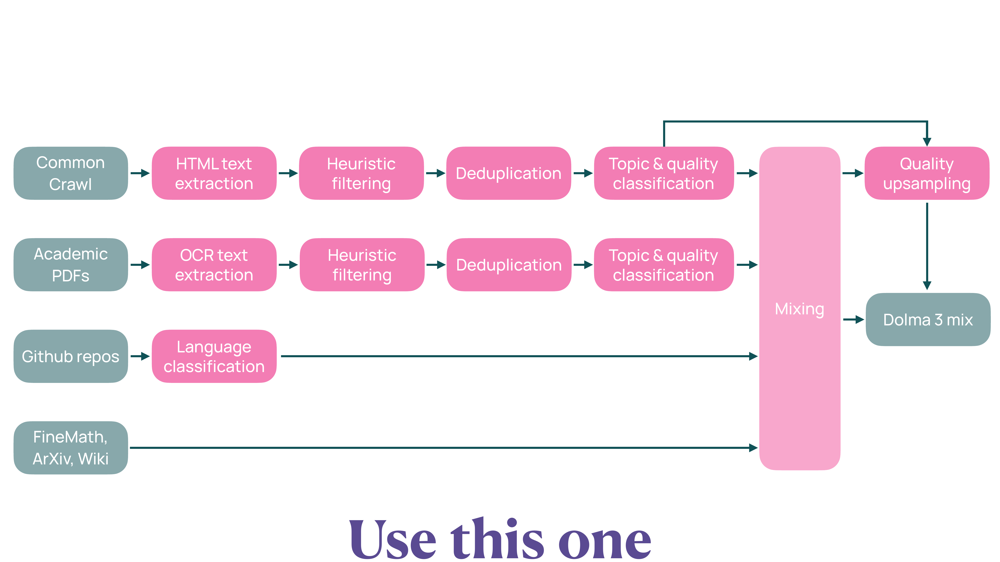

# Dolma 3

Dolma 3 は、Olmo 3 Base モデルの事前学習に使用される大規模なデータセットである。**Dolma 3 Mix** として知られる約 6 兆トークンの多様なデータで構成されており、Web ページ、学術 PDF、コードリポジトリ、数学データなど、複数のデータソースを含んでいる。

## 概要と目的

Dolma 3 の主な目的は、Olmo 3 Base モデルに幅広い知識と能力を与えることである。データセットは、最も計算集約的な事前学習ステージ（全体の計算量の 90% 以上を消費）で使用されるため、スケーラビリティと品質が重要視されている。

**データ戦略の基本原則**:

- **規模の重要性**: 事前学習に影響を与えるには、兆トークンスケールで十分な量のデータが必要
- **タスクデータの扱い**: 構造化されたタスクデータ（質問応答（Question Answering, QA）ペア、チャットインスタンスなど）は、後の中間訓練や長文脈拡張のステージで使用し、事前学習では使用しない

## データソースの構成 {#sec-dolma3-composition}

Dolma 3 Mix は、複数のデータソースから構成されている。以下の表は、各ソースのトークン数と文書数を示している。

| データソース | タイプ | 9T プール | 6T Mix | 6T Mix 割合 |
|-------------|--------|-----------|--------|-------------|
| Common Crawl | Web ページ | 8.14T トークン 9.67B 文書 | 4.51T トークン 3.15B 文書 | 76.1% |
| olmOCR science PDFs | 学術文書 | 972B トークン 101M 文書 | 805B トークン 83.8M 文書 | 13.6% |
| Stack-Edu (Rebalanced) | GitHub コード | 137B トークン 167M 文書 | 409B トークン 526M 文書 | 6.89% |
| arXiv | LaTeX 論文 | 21.4B トークン 3.95M 文書 | 50.8B トークン 9.10M 文書 | 0.86% |
| FineMath 3+ | 数学 Web ページ | 34.1B トークン 21.4M 文書 | 152B トークン 95.5M 文書 | 2.56% |
| Wikipedia & Wikibooks | 百科事典 | 3.69B トークン 6.67M 文書 | 2.51B トークン 4.24M 文書 | 0.04% |
| **合計** | | **9.31T トークン** **9.97B 文書** | **5.93T トークン** **3.87B 文書** | **100%** |

: Dolma 3 Mix のデータソース構成 {#tbl-dolma3-composition}

### データソースの説明

**Common Crawl (Web ページ)**:

- 最も大きな割合を占めるデータソース（76.1%）
- 多様な Web ページから抽出されたテキストデータ
- 2024 年 12 月 31 日までのデータを含む

**olmOCR science PDFs (学術文書)**:

- 学術 PDF を線形化プレーンテキストに変換した新しいデータソース
- 238 百万件のユニークな PDF 文書から抽出
- olmOCR ツールを使用してテキスト抽出

**Stack-Edu (GitHub コード)**:

- The Stack v2 データセットから厳選した教育的プログラミングコンテンツ
- プログラミング言語別に分割され、最適なミックスが適用される

**arXiv (LaTeX 論文)**:

- Proof-Pile-2 データセットから取得
- 元の LaTeX 記法を保持し、数学的内容と適切なフォーマットの両方を学習可能

**FineMath 3+ (数学 Web ページ)**:

- 数学的教育コンテンツを含む Common Crawl 文書のサブセット
- 数学記法を適切に保持するように再処理

**Wikipedia & Wikibooks (百科事典)**:

- 英語版と Simple 版の Wikipedia と Wikibooks
- 百科事典的知識のベースソース

## 主要な革新点

Dolma 3 は、3 つの主要な技術革新を導入している。

### 1. グローバル重複排除 (Deduplication)

Dolma 3 では、兆トークンスケールで高速かつスケーラブルなグローバル重複排除を実現するために、**Duplodocus** という新しいツールを開発した。

重複排除は 3 つのステージで実施される:

**Stage 1: 完全重複排除 (Exact Deduplication)**:

- 文書テキストハッシュに基づくグローバル重複排除
- すべての完全コピーを削除
- 67% のデータを重複として識別し、38.7B から 12.8B 文書に削減

**Stage 2: 曖昧重複排除 (Fuzzy Deduplication)**:

- MinHash ベースの重複排除で、ほぼ同一の文書を識別・削除
- ヘッダーやフッターのみが異なる文書（複数ドメイン間でコピーされた文書）を削除
- 23% のデータを重複として識別し、9.8B 文書に削減

**Stage 3: 部分文字列重複排除 (Substring Deduplication)**:

- 新しいファジー suffix-array ベースの重複排除手順
- 個別文書内の繰り返しコンテンツ（ボイラープレートテキストや HTML アーティファクト）を削除
- 500 バイト以上の繰り返し部分文字列をマーク
- 14% のテキストバイトを削除し、9.7B 文書（36.5T バイト）に削減

この 3 段階の手順により、Web コーパスは 38.7B から 9.7B 文書に削減された（文書数で 75% 削減）。

### 2. Token-constrained Mixing と Quality-aware Upsampling

Dolma 3 では、データミキシングの 2 つの新しい手法を導入している。

**Token-constrained Mixing (トークン制約付きミキシング)**:

- Swarm ベースのアプローチを使用して、多数の小型プロキシモデルを訓練・評価
- これらの結果を使用して最適なミックスを決定
- 条件付きミキシング手順により、データソースが継続的に改善・更新される開発サイクルに対応

Token-constrained Mixing の手順:

1. **Swarm 構築**: 異なるミキシング比率で多数の小型プロキシモデルを訓練
2. **タスクごとの回帰**: 各プロキシモデルがミキシング重みをタスク性能にマッピング
3. **ミックス最適化**: 平均タスク BPB（bits-per-byte）を最小化するミキシングを発見

**Quality-aware Upsampling (品質認識アップサンプリング)**:

- 各トピック内の品質バリエーションを考慮
- 高品質な文書を選択的に繰り返すことで、全体的な繰り返しを最小限に抑えながら、高品質データの繰り返しを集中させる

### 3. olmOCR science PDFs

olmOCR science PDFs は、学術 PDF を線形化プレーンテキストに変換した新しいデータソースである。従来の peS2o データセットを置き換える形で導入された。

**特徴**:

- AI2Bot として識別される「礼儀正しい」クローリング
- robots.txt を遵守し、ペイウォールを回避しない
- 学術サイトと論文リポジトリに焦点を当てたクローリング
- olmOCR（バージョン 0.1.49-0.1.53）を使用してテキスト抽出

**データ規模**:

- 238 百万件のユニークな PDF 文書（2024 年 12 月までのカットオフ日）
- テキスト抽出後、160 百万件の PDF 文書
- 重複排除後、156 百万件の文書

## データキュレーションのパイプライン

Dolma 3 Mix のデータキュレーションは、@fig-dolma3-pipeline に示すフローで実施される。Common Crawl と学術 PDF は HTML/OCR テキスト抽出 → ヒューリスティックフィルタ → 重複排除 → トピック・品質分類という同じパイプラインを通り、GitHub と FineMath/arXiv/Wiki は別の専用処理を経て、最終的に Mixing と Quality upsampling で統合される。

{#fig-dolma3-pipeline}

**パイプラインの主要ステップ**:

1. **テキスト抽出**: HTML または PDF からテキストを抽出
2. **ヒューリスティックフィルタリング**: 低品質文書、スパム、アダルトコンテンツを削除
3. **重複排除**: 完全重複、曖昧重複、部分文字列重複を削除
4. **トピック・品質分類**: WebOrganizer ツールで 24 のトピックに分類し、品質スコアを付与
5. **ミキシング**: Token-constrained mixing でデータソースの最適な比率を決定
6. **品質アップサンプリング**: 高品質文書を選択的に繰り返す

## 3 つのステージでの使用方法

Dolma 3 データセットは、Olmo 3 の訓練プロセスの 3 つのステージで使用される。

### Stage 1: Pretraining (事前学習)

**使用データ**: Dolma 3 Mix（6T トークン）

**目的**: 多様な知識と能力を持つ基盤モデルを構築

**データソース**:

- Common Crawl: 76.1%
- olmOCR science PDFs: 13.6%
- Stack-Edu: 6.89%
- arXiv: 0.86%
- FineMath 3+: 2.56%
- Wikipedia & Wikibooks: 0.04%

### Stage 2: Midtraining (中間訓練)

**使用データ**: Dolma 3 Dolmino Mix（100B トークン）

**目的**: コード、数学、一般知識 QA などの重要な能力を強化

**特徴**: Post-training の下準備として、指示データと思考トレースを意図的に含める

詳細な Midtraining の説明は別の文書で扱われる。

### Stage 3: Long-Context Extension (長文脈拡張)

**使用データ**: Dolma 3 Longmino Mix（50-100B トークン）

**目的**: 最大 65K トークンのコンテキストをサポートする長文脈能力を獲得

**データ規模**:

- 7B モデル: 50B トークン
- 32B モデル: 100B トークン

**データソースの規模**:

- 8K トークン以上: 22.3M 文書（640B トークン）
- 32K トークン以上: 4.5M 文書（380B トークン）

これは、長文脈研究のための最大のオープン利用可能なコレクションである。

詳細な Long-Context Extension の説明は別の文書で扱われる。

## データミキシングの結果

Token-constrained mixing により、データソースの最適な比率が決定された。

**Web テキストのトピック分布**:

- STEM ドメイン（「Science, Math, and Technology」、「Software Development」）を大幅にアップウェイト
- 1B パラメータモデルで 5x Chinchilla の訓練を行った結果、平均 0.056 BPB の改善を達成
- 54 タスク中 13 タスクでのみ性能低下が見られ、最大でも 0.035 BPB の低下に留まる

**Stack-Edu のプログラミング言語分布**:

- Python を Java や Markdown よりも優先
- ほぼすべてのコーディングベンチマークで改善を達成

::: {.callout-note collapse="true"}
## 実験用のサンプルミックス

Dolma 3 では、より少ない計算リソースで実験できるように、サンプルミックスも公開している。

**Pretraining サンプルミックス**:

- 150B トークン
- Dolma 3 Mix と同じデータソース構成

**利点**:

- 小規模な実験が可能
- データミキシングのアブレーション研究に有用
- コンピューティングリソースが限られた研究者も利用可能
:::

## まとめ

Dolma 3 は、Olmo 3 Base モデルの事前学習に使用される大規模で高品質なデータセットである。グローバル重複排除、Token-constrained mixing、Quality-aware upsampling などの革新的な手法により、最適なデータミキシングを実現している。

**主な特徴**:

- **多様なデータソース**: Web、学術 PDF、コード、数学、百科事典など
- **大規模**: 6 兆トークン（Dolma 3 Mix）
- **高品質**: 重複排除とヒューリスティックフィルタリングによる品質管理
- **最適化されたミキシング**: Swarm ベースの手法で最適な比率を決定
- **3 つのステージ**: Pretraining、Midtraining、Long-Context Extension で使用

Dolma 3 は完全にオープンで、研究者が再現性の高い研究を行えるようにすべてのデータソース、処理パイプライン、ミキシング比率を公開している。
