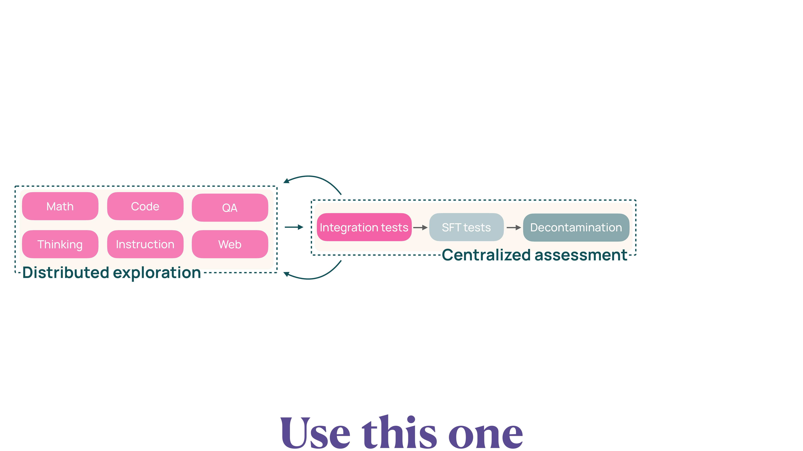

# Midtraining

Olmo 3 の訓練は、事前学習後に **Midtraining**（中間訓練）という追加ステージを経る。このフェーズでは 100B 個の高品質トークンを使用して、数学推論、コード生成、質問応答、指示追従、推論思考などの重要な能力を強化する。

## 概要

Midtraining は事前学習と後続の SFT（Supervised Fine-Tuning）の橋渡しを行う。データセットとして **Dolma 3 Dolmino Mix** を使用し、以下の特徴を持つ。

- 100B トークンの高品質データ
- ターゲット能力に特化したデータソースの選定
- Decontamination による評価データセットの汚染除去
- Microanneal と Integration tests による効果的なデータミックス設計

## Methodological Framework

Midtraining のデータキュレーションは **2部構成のフレームワーク**で行われる（@fig-midtraining-framework）。左側の Distributed exploration では Math / Code / 質問応答（Question Answering, QA） / Thinking / Instruction / Web の各データソースを軽量に評価し、右側の Centralized assessment で候補ミックスを Integration tests → SFT tests → Decontamination の順に検証する。両者がフィードバックループでつながり、有望なソースは集中評価に進み、結果が再び分散探索に戻される。

{#fig-midtraining-framework}

### Distributed Exploration（分散探索）

各データソースについて、軽量なフィードバックループで効果を評価する。

- **Microanneal**: 5B トークンのターゲットデータ + 5B Web データ
- **Baseline**: Web のみの 10B トークン
- 迅速な評価により、有望なデータソースを特定

### Centralized Assessment（集中評価）

選定された候補データセットを組み合わせて統合テストを実施する。

- **Integration tests**: 100B トークンの完全な annealing run
- データソース間の相互作用を評価
- SFT 訓練後の性能も測定

## Midtraining データの構成

Table 5 に示される Dolmino Mix は、以下のターゲット能力ごとにデータソースを構成している。

| Capability | Dataset | Token Count | Description |
|------------|---------|-------------|-------------|
| **Math** | TinyMATH | ~5B | Math problem-solution pairs |
| | CraneMath | ~3B | Mathematical reasoning |
| | MegaMatt | ~2B | Advanced mathematics |
| | Dolmino Math | ~4B | Curated math corpus |
| **Code** | Stack-Edu (Fill-In-Middle（FIM）) | ~10B | Educational code with Fill-In-Middle |
| | CraneCode | ~5B | High-quality code snippets |
| **QA** | Reddit-to-Flashcards | ~3B | Question-answer extraction |
| | Wiki-to-RCQA | ~4B | Reading comprehension QA |
| | Nemotron | ~2B | Synthetic QA pairs |
| **Instruction** | Tulu3 SFT | ~2B | Instruction-following examples |
| | Flan | ~3B | Task-oriented instructions |
| **Thinking** | Meta-reasoning | ~2B | Chain-of-thought reasoning |
| | Program-verifiable | ~1B | Verifiable reasoning traces |
| | OMR rewrite | ~1B | Reasoning rewriting |
| **Web** | Dolma v1.7 Web | ~50B | General web content (baseline) |

::: {.callout-note}
## Dolmino Mix の設計方針

各能力ごとに複数のデータソースを組み合わせることで、単一データセットに依存せず、能力の汎化性能を向上させている。
:::

## Capability Improvements

各ターゲット能力での改善結果（Section 3.5.2）。

### Math（数学推論）

- TinyMATH: 基本的な算術・代数問題
- CraneMath: 複雑な数式処理と証明
- MegaMatt: 大学レベルの数学問題
- Dolmino Math: 上記を統合したキュレーションコーパス

### Code（コード生成）

- **Stack-Edu (FIM)**: Fill-In-Middle 形式での教育的コード
- **CraneCode**: 高品質なコードスニペット（複数言語）

::: {.callout-tip}
## Fill-In-Middle (FIM)

コードの中間部分を予測するタスクである。実際の IDE での補完シナリオに近い。
:::

### QA（質問応答）

- **Reddit-to-Flashcards**: Reddit の議論から QA ペアを抽出
- **Wiki-to-RCQA**: Wikipedia 記事から読解問題を生成
- **Nemotron**: 合成 QA データセット

### Instruction（指示追従）

- **Tulu3 SFT**: 多様な指示追従タスク
- **Flan**: タスク指向の指示データ

### Thinking（推論思考）

- **Meta-reasoning**: Chain-of-Thought (CoT) スタイルの推論
- **Program-verifiable**: プログラムで検証可能な推論トレース
- **OMR rewrite**: 推論プロセスのリライト

## Decontamination

Section 3.5.3 で詳述されている **decontamination**（汚染除去）プロセスである。

新しい **decon パッケージ** を開発し、評価データセットとの重複を除去する。

- n-gram ベースのマッチング
- 評価ベンチマークの汚染検出
- 訓練データからの除外処理

::: {.callout-warning}
## 評価データの汚染リスク

高品質データセットには、評価ベンチマークと重複するサンプルが含まれる可能性がある。Decontamination により公平な評価を保証している。
:::

## Key Findings

Section 3.5.4 の主要な発見。

- **Microanneal の有効性**: 10B トークンの軽量テストで、100B の完全 run の結果を予測可能
- **データソースの相補性**: 複数データソースの組み合わせが単一データセット以上の効果
- **SFT との相性**: Midtraining で強化された能力は、SFT 後もさらに向上
- **Decontamination の必要性**: 汚染除去により評価精度が大幅に改善

## 関連セクション

- [全体像](overview.qmd): Olmo 3 の訓練パイプライン全体
- [Dolma 3 データセット](dolma3-dataset.qmd): Stage 1 の事前学習データ
- [Dolci データセット](dolci-dataset.qmd): Stage 3 の Post-training データ
