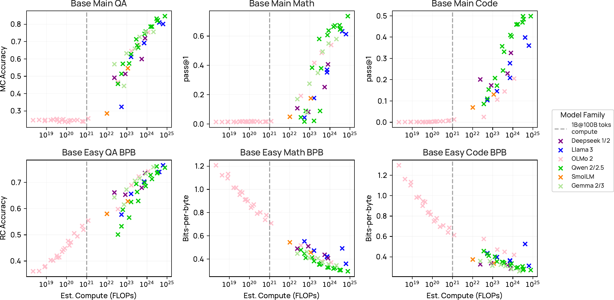

# OlmoBaseEval

OlmoBaseEval は、Base モデル（事前学習済みモデル）の性能を効率的に評価するために設計されたベンチマークスイートである。従来の評価手法が抱える課題を解決し、小規模モデルでも信頼性の高い評価を可能にする。

## 背景と目的

言語モデルの開発プロセスでは、学習途中のモデルを頻繁に評価する必要がある。しかし、既存の評価ベンチマークの多くは完全に学習されたモデルや、指示チューニングされた大規模モデルを対象としており、小規模な Base モデルの評価には適していない。

OlmoBaseEval は、以下の目的で開発された。

- 小規模モデルでも意味のある評価結果を提供
- 学習途中のモデルの進捗を正確に追跡
- 計算コストを抑えつつ高い評価精度を実現
- モデルの基礎能力を多角的に測定

## 従来手法の課題

小規模な Base モデルの評価には、主に3つの課題が存在する。

::: {.callout-note}
## 課題1: ランダムチャンス性能

小規模モデルは多くのタスクでランダム選択と変わらない性能しか示さない。例えば、4択問題でモデルが学習していない場合、正答率は25%前後に留まり、実質的な能力測定ができない。
:::

::: {.callout-note}
## 課題2: スコア差の小ささ

学習が進んでもスコアの変化が微小であり、改善の有無を判断しにくい。統計的に有意な差を検出するには、非常に多くのサンプルが必要となる。
:::

::: {.callout-note}
## 課題3: 評価の不安定性

タスクによってはノイズが大きく、同じモデルでも評価のたびに結果が変動する。これにより、真の性能向上とノイズによる変動を区別できない。
:::

## 解決策の3つの柱

OlmoBaseEval は、上記の課題に対して3つのアプローチで対処する。

### タスククラスタリング

類似した能力を評価する複数のタスクを集約することで、評価の信頼性を向上させる。

個別のタスクではノイズが大きくても、同じ能力を測定する複数のタスクの結果を統合することで、より安定した評価指標が得られる。これにより、モデルの特定の能力（例: 推論能力、言語理解能力）を正確に測定できる。

タスククラスタリングのメリットである。

- 単一タスクのノイズを平均化
- 能力の多面的な評価
- 評価の再現性向上

### プロキシメトリック

小規模モデルに適した評価指標を導入する。

従来の正答率ベースの評価では、小規模モデルの能力を捉えきれない。プロキシメトリックは、正答/誤答の二値ではなく、モデルの出力分布や確信度などを考慮した連続的な指標を用いる。

代表的なプロキシメトリックである。

- **Masked Perplexity**: 特定のトークンに対するモデルの予測確率を測定
- **Probability-based metrics**: 正解選択肢への確率割り当てを評価
- **Calibration metrics**: モデルの確信度と実際の正答率の整合性を測定

これらの指標は、モデルが完全に学習していない段階でも、学習の進捗を捉えることができる。

### シグナルノイズ比の改善

評価タスクのシグナルノイズ比を分析し、信頼性の高いタスクのみを選定する。

すべてのタスクが等しく有用というわけではない。OlmoBaseEval では、各タスクのシグナルノイズ比を測定し、小規模モデルでも安定した結果を示すタスクを優先的に採用する。

シグナルノイズ比の分析手法である。

- 複数のモデルサイズでの評価結果の一貫性を確認
- 同一モデルの複数回評価での分散を測定
- スケーリング則との整合性を検証

## 新しいベンチマーク

OlmoBaseEval は、以下の4つの新規ベンチマークを含む。

### BasicSkills

基本的な言語理解と推論能力を測定する6つのタスク。

- **Reading Comprehension**: 短文の理解と情報抽出
- **Fact Recall**: 基本的な知識の記憶
- **Simple Logic**: 基礎的な論理推論
- **Pattern Recognition**: パターンの認識と予測
- **Basic Math**: 算数レベルの数値計算
- **Common Sense**: 常識的な推論

これらのタスクは、小規模モデルでもランダムチャンスを超える性能を示すよう設計されている。

### Gen2MC

生成タスクを多肢選択形式に変換した5つのタスク。

従来、生成タスクは Base モデルの評価に適さないとされてきた。Gen2MC は、生成の品質を多肢選択形式で評価することで、この問題を解決する。

- **Summarization**: 要約の適切性を選択肢から判定
- **Translation**: 翻訳の正確性を評価
- **Paraphrasing**: 言い換えの妥当性を測定
- **Question Generation**: 質問生成の質を評価
- **Title Generation**: タイトル生成の適切性を判定

この形式により、生成タスクでも確率ベースの評価が可能になる。

### MT MBPP

多言語プログラミングベンチマーク（17言語対応）。

MBPP（Mostly Basic Programming Problems）を17の自然言語に翻訳したベンチマーク。モデルの多言語理解能力とコーディング能力を同時に評価する。

対応言語の例である。

- ヨーロッパ言語: 英語、スペイン語、フランス語、ドイツ語
- アジア言語: 日本語、中国語、韓国語、ヒンディー語
- その他: アラビア語、ロシア語、ポルトガル語

各言語で同一の問題セットを評価することで、言語間の性能差を分析できる。

### Masked Perplexity

マスクされたトークンの予測精度を測定する評価手法。

特定の重要なトークン（名詞、動詞など）をマスクし、モデルがそれらをどの程度正確に予測できるかを評価する。この手法は、小規模モデルでも連続的なスコアを提供し、学習の進捗を細かく追跡できる。

Masked Perplexity の特徴である。

- 連続的なスコアリング（二値判定ではない）
- 文脈理解能力の直接的な測定
- 計算コストが低い
- 学習初期段階から有意な差を検出

## 評価の実践

OlmoBaseEval を用いた評価は、以下の流れで実施される。

1. **ベースライン測定**: 学習開始前のランダム初期化モデルを評価
2. **定期評価**: 学習ステップごとに自動評価を実行
3. **クラスタ分析**: タスククラスタごとの性能変化を追跡
4. **スケーリング予測**: 小規模モデルの結果から大規模モデルの性能を推定

::: {.callout-tip}
## 評価の頻度

小規模モデル（1B パラメータ未満）では、数百ステップごとの評価が推奨される。大規模モデルでは、計算コストを考慮して評価頻度を調整する。
:::

## スケーリング分析との統合

OlmoBaseEval は、スケーリング則の分析と組み合わせることで、さらなる洞察を提供する。

小規模モデルでの評価結果をもとに、より大規模なモデルの性能を予測できる。これにより、大規模モデルを実際に学習する前に、学習戦略の有効性を検証できる。

@fig-olmobaseeval-scaling に示すように、Main タスク（上段）は計算量が小さい領域では正答率がほぼ random chance に張り付くのに対して、Easy タスク（下段）は BPB（bits-per-byte）が連続的に低下するため、より早い段階から学習進捗を検出できる。OlmoBaseEval は、この Main / Easy のペアと計算予算ごとに信頼できるタスクを整理することで、Base モデルの開発中に少ない計算で意味のあるシグナルを取り出している。

{#fig-olmobaseeval-scaling}

予測精度の向上には、以下の要素が重要である。

- 複数のモデルサイズでの評価データ
- タスククラスタごとのスケーリング曲線
- 学習データ量との相関分析

## 計算効率

OlmoBaseEval は、従来の評価スイートと比較して、大幅に計算コストを削減する。

| 評価スイート | GPU 時間 |
|------|-----:|
| 従来手法 | 100 |
| OlmoBaseEval | 10 |

OlmoBaseEval は評価コストを約 **90%** 削減する。

効率化に寄与する要因は次の通り。

- タスク数の最適化（重複の排除）
- プロキシメトリックによる評価時間短縮
- バッチ処理の最適化

## まとめ

OlmoBaseEval は、Base モデルの評価における以下の革新をもたらす。

- **小規模モデルでの信頼性**: ランダムチャンス性能を超える評価を実現
- **効率性**: 計算コストを大幅に削減
- **多角的評価**: タスククラスタリングによる能力の包括的測定
- **予測可能性**: スケーリング分析との統合

この評価スイートにより、モデル開発の初期段階から、データ効率的かつ計算効率的な学習戦略の検証が可能になる。
