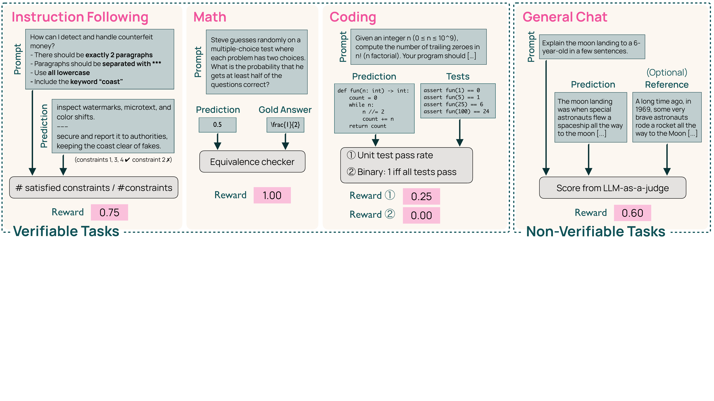
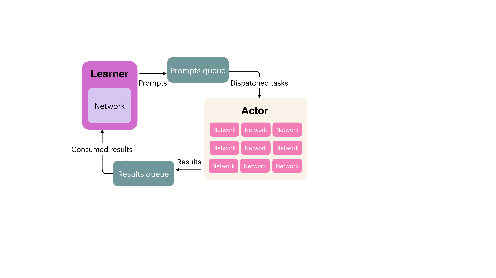

# OlmoRL / GRPO

OlmoRL は、思考型モデル（reasoning model）の強化学習訓練を効率化するために開発されたフレームワークである。Group Relative Policy Optimization（GRPO）をベースとし、Reinforcement Learning with Verifiable Rewards（RLVR）の手法を採用している。

Post-training の第3段階として、数学、コーディング、指示追従、一般的なチャットの複数ドメインにわたり、検証可能な報酬と言語モデル（Language Model, LM）-judge 報酬を組み合わせた強化学習を実施する。

## OlmoRL の概要

OlmoRL は、長い推論トレースを伴う強化学習の課題に対処するため、アルゴリズムとエンジニアリングインフラを密接に統合したシステムである。従来の数学とコードに限定されていた RLVR を、より幅広い検証可能なタスクへと拡張している。

**主な特徴**:

- **アルゴリズムの改善**: GRPO をベースに、DAPO や Dr GRPO などの最新の改善を統合
- **大規模データセット**: Dolci-Think-RL（約 100K プロンプト、4 ドメイン）
- **効率的なインフラ**: 長いシーケンス（最大 32K トークン）を効率的に処理する分散訓練システム
- **4倍の高速化**: OLMo 2 の RL インフラと比較して約 4 倍の高速化を達成

## OlmoRL アルゴリズムの詳細

OlmoRL の強化学習段階は、GRPO（Shao et al., 2024）をベースに構築され、DAPO（Yu et al., 2025）や Dr GRPO（Liu et al., 2025b）などの最新のアルゴリズム改善を統合している。

### Vanilla GRPO からの改善点

OlmoRL は、Vanilla GRPO に対して以下の改善を実施している：

**1. Zero gradient signal filtering**:

- 報酬がすべて同一のグループ（advantage の標準偏差がゼロ）を除外
- ゼロ勾配のサンプルでの訓練を回避（DAPO と同様）

**2. Active sampling**:

- Zero gradient filtering にもかかわらず、一貫したバッチサイズを維持
- 動的サンプリングの改良版を実装（詳細は §4.4.3）

**3. Token-level loss**:

- サンプルごとではなく、バッチ全体のトークン数で損失を正規化
- 長さバイアスを回避

**4. No KL（Kullback-Leibler） loss**:

- KL 損失を削除（GLM-4.5、DAPO、Dr GRPO などと同様の実践）
- より制限の少ないポリシー更新を可能にし、過最適化や訓練の不安定化を引き起こさない

**5. Clip higher**:

- 上限クリッピング項を下限よりわずかに高く設定
- トークンに対するより大きな更新を可能にする（Yu et al., 2025）

**6. Truncated importance sampling**:

- 推論エンジンと訓練エンジン間の対数確率の差を調整
- 切り詰められた重要度サンプリング比を損失に掛ける（Yao et al., 2025）

**7. No standard deviation normalization**:

- Advantage 計算時に標準偏差で正規化しない（Liu et al., 2025b）
- 難易度バイアスを除去（報酬の標準偏差が低い問題の advantage が過度に増加するのを防止）

### OlmoRL の目的関数

最終的な目的関数は、token-level loss、truncated importance sampling、clip-higher、および advantage 計算における標準偏差正規化なしを含む：

$$
J(\theta) = \frac{1}{\sum_{i=1}^{G} |y_i|} \sum_{i=1}^{G} \sum_{t=1}^{|y_i|} \min\left(\frac{\pi(y_{i,t} | x, y_{i,<t}; \theta_{\text{old}})}{\pi_{\text{vllm}}(y_{i,t} | x, y_{i,<t}; \theta_{\text{old}})}, \rho\right) \times \min(r_{i,t} A_{i,t}, \text{clip}(r_{i,t}, 1 - \varepsilon_{\text{low}}, 1 + \varepsilon_{\text{high}}) A_{i,t})
$$

ここで：

- $r_{i,t} = \frac{\pi(y_{i,t}|x,y_{i,<t};\theta)}{\pi(y_{i,t}|x,y_{i,<t};\theta_{\text{old}})}$
- $\varepsilon_{\text{low}}$ と $\varepsilon_{\text{high}}$ はクリッピングハイパーパラメータ
- $\rho$ は truncated importance sampling の上限値
- Advantage $A_{i,t}$ は、グループ $G$ 内での相対報酬に基づいて計算：

$$
A_{i,t} = r(x, y_i) - \text{mean}(\{r(x, y_i)\}_{i=1}^{G})
$$

::: {.callout-note collapse="true"}
## GRPO と PPO（Proximal Policy Optimization）の比較

GRPO は PPO の変種であり、主な違いは報酬の正規化方法にある。

**PPO**:

- 報酬を全データセットまたはバッチ全体で正規化
- グローバルなベースラインを使用

**GRPO**:

- 同じプロンプトから生成された応答グループ内で報酬を正規化
- グループベースの相対的な品質評価により、学習の安定性が向上
- 思考型モデルのように出力長が大きく異なる場合に特に有効

**OlmoRL の改善**:

- Vanilla GRPO に対して 7 つの主要な改善を実施
- Zero gradient filtering と active sampling により、訓練の効率と安定性を大幅に向上
:::

### Verifiers（検証器）

OlmoRL は、OLMo 2 の数学ドメインを超えて、一般的なドメインへと検証可能な報酬を拡張している。各ドメインに対して異なるカスタム検証器を使用する。@fig-olmorl-verifiers に、Instruction Following・Math・Coding（Verifiable）と General Chat（Non-verifiable）の検証器の動作例を示す。

{#fig-olmorl-verifiers}

**Math（数学）**:

- ルールベースの検証器
- 基本的な正規化を実行し、SymPy を使用して参照回答と比較
- 参照回答と同じであれば 1、そうでなければ 0 を返す

**Code（コーディング）**:

- テストケースベースの検証器
- 応答に対して一連のテストケースを実行
- (a) 通過したテストケースの割合を報酬とする、または (b) すべてのテストケースを通過した場合に 1、そうでなければ 0 を返す

**Instruction-following（指示追従）**:

- プロンプトからの一連の制約への準拠をチェックする関数セットを通して応答を渡す
- すべての制約が満たされている場合に 1、そうでなければ 0 を返す

**Chat—reference（参照付きチャット）**:

- ground-truth 応答がある場合、LM judge を使用してモデルの応答を参照回答と比較
- 応答の品質に基づいて [0, 1] のスコアを付与

**Chat—open-ended（オープンエンドチャット）**:

- 参照回答なしで、LM judge を使用して応答の品質に基づいて [0, 1] のスコアを付与

## Dolci-Think-RL データセット

Dolci-Think-RL は、4 つのドメイン（数学、コーディング、指示追従、一般的なチャット）にわたる約 100K のサンプルからなる大規模で多様なデータセットである。多様な推論タスクでの堅牢な RL を支援しながら、一般的な有用性を維持する。

### データセット構成

| カテゴリ | データセット | Think RL 用プロンプト数 | Instruct RL 用プロンプト数 |
|---------|------------|---------------------|----------------------|
| **Precise IF** | IF-RLVR | 30,186 | 38,000 |
| **Math** | Open-Reasoner-Zero | 3,000 | 14,000 |
|  | DAPO-Math | 2,584 | 7,000 |
|  | AceReason-Math | 6,602 | - |
|  | Polaris-Dataset | - | 14,000 |
|  | KlearReasoner-MathSub | 3,000 | 9,000 |
|  | OMEGA-train | 15,000 | 20,000 |
| **Coding** | AceCoder | 9,767 | 20,000 |
|  | KlearReasoner-Code | 8,040 | - |
|  | Nemotron Post-training Code | 2,303 | - |
|  | SYNTHETIC-2 | 3,000 | - |
| **General Chat** | Tulu 3 SFT | 7,129 | 18,955 |
|  | Wildchat-4.8M | 7,129 | 18,761 |
|  | Multi-Subject RLVR | 7,129 | 12,234 |
| **合計** |  | **104,869** | **171,950** |

### データ構築プロセス

**Step 1: プロンプトの調達**:

各ドメインから高品質なプロンプトを収集し、キュレーションする。

- **Math**: Open-Reasoner-Zero、DAPO-Math、AceReason-Math、KlearReasoner-MathSub、OMEGA など
- **Coding**: AceCoder、Klear-Reasoner Code、Nemotron Post-training Code、SYNTHETIC-2 など
- **Instruction-following**: IF-RLVR（最大 5 つの制約、IFEval と IFBench-Train からサンプリング）
- **General chat**: Tülu 3 SFT、WildChat-4.8M、Multi-subject-RLVR

**Step 2: オフライン難易度フィルタリング**:

- モデルの初期チェックポイントから各プロンプトに対して 8 つのロールアウトを生成
- モデルが容易に解決するサンプル（pass rate > 62.5%）を除外
- 温度 1.0、top-p 1.0 でサンプリング（RL 訓練時と一致）

**Step 3: データミキシング**:

- ドメイン固有の実験を実施し、最初の 500-1000 ステップで下流評価のトレンドを観察
- 高品質なデータセットをアップウェイト
- 各ドメインでほぼ同等のデータ量を使用（数学と指示追従にわずかに重点）
- OMEGA から特定のサブタスクをダウンサンプル

## OlmoRL インフラストラクチャ

OlmoRL は、長いシーケンスとより高速な全体的スループットを処理するために、強化学習インフラストラクチャに大幅な改善を加えた。

### 計算リソース

RL での主要な技術的課題は、推論（ロールアウト）の管理である。最終モデルでは、最大 32K トークンの長さのロールアウトを生成し、平均 10K トークン以上になる。

**リソース配分**（32B モデルの場合）:

- **訓練**: 8 H100 ノード
- **推論**: 20 ノード
- **GPU 利用率**: 推論が訓練の約 5 倍の計算量を使用

自己回帰推論のコストが高いため、学習器は時間の 75% をデータ待ちに費やす。

### 主要な技術革新

インフラは 4 つの柱から成る:

1. **Fully Asynchronous Training** — 中央集権的な学習器を複数ノードに分散（DeepSpeed）し、独立した vLLM アクター群とキュー経由で連携する。
2. **Continuous Batching** — 各生成の終了とともに新しい生成を投入し、静的バッチングに対し最大 54% の計算を節約する。
3. **Active Sampling** — ゼロ勾配でないバッチが揃うまでプロンプトを継続的に再サンプリングし、DAPO の動的オーバーサンプリングより 3 倍効率的である。
4. **Inflight Updates** — 生成エンジンを止めず KV キャッシュを無効化せずに重みを更新し、最大 4 倍のスループットを実現する。

以下、それぞれを詳述する。

**Fully Asynchronous Training**（@fig-olmorl-distributed）:

- 中央集権的な学習器を複数ノードに分散（DeepSpeed 使用）
- 大規模なアクタープール、それぞれ独立した vLLM インスタンスを実行
- 学習器がプロンプトをキューに入れ、アクターに配信
- アクターが環境と相互作用し、結果をキューを通じて返す

{#fig-olmorl-distributed}

**Continuous Batching**:

- 各生成が終了するたびに新しい生成を絶えずエンキュー
- 静的バッチングと比較して、長い生成での計算の無駄を削減
- Olmo 3 では、32K 生成長で平均 14,628 トークン、最大 32K トークン
- 静的バッチングでは最大 54% の計算が無駄になっていた

**Active Sampling**:

- フィルタリングされたインスタンスを補償するため、継続的にアクターから補完を引き出し、プロンプトをキューに再サンプリング
- ゼロ勾配でない補完の所望のバッチサイズに到達するまで、アクティブにサンプリングとフィルタリングを実施
- DAPO の動的サンプリング（3 倍のオーバーサンプリング）よりも効率的

**Inflight Updates**:

- 各訓練ステップ後、生成エンジンを一時停止せずに重みを即座に更新
- スレッドセーフな生成フレームワークに依存し、KV キャッシュを無効化せずに生成を継続
- 同じリソースで最大 4 倍の高速化を達成

### インフラ改善の効果

| 設定 | 総トークン数 (Mtok) | トークン/秒 | MFU (%) | MBU (%) |
|------|-------------------|------------|---------|---------|
| OLMo 2 | 6.34 | 881 | 0.30 | 12.90 |
| + continuous batching | 7.02 | 975 | 0.33 | 14.29 |
| + better threading | 9.77 | 1358 | 0.46 | 19.89 |
| + inflight updates (Olmo 3) | 21.23 | 2949 | 1.01 | 43.21 |

Inflight updates の追加が最も劇的な改善をもたらしている。

## Olmo 3.1 Think 32B の拡張訓練

Olmo 3.1 Think 32B は、拡張された OlmoRL 訓練を通じて、性能向上を示した。Dolci Think RL データセットでの追加エポックにより、以下の改善が観察された：

**性能向上**:

- **AIME 2024**: +4 ポイント
- **IFBench**: +20 ポイント
- **他のベンチマーク**: 性能を維持

拡張訓練により、より長い RL 訓練が汎化性能を向上させ、破局的忘却なしに安定した訓練が可能であることが確認された。

## 主要な発見

### Delta Learning が RLVR のより強力な初期化を提供

Delta Learning を用いた選好調整を先に実施してから RLVR を適用すると、SFT 単独よりも優れた全体的な性能を達成する。

### DPO と SFT の両方が RL から恩恵を受けるが、DPO がより良い開始点

最終的な RL ミックスを DPO モデルで実行すると、SFT モデルで実行する場合よりも一貫して優れた性能を示す。

**主要な違い**:

- RL が改善しない評価では、DPO モデルがしばしば優れた性能を発揮し、RL 訓練中もその優位性を維持（例: AlpacaEval）
- RL によって明示的にターゲットにされた評価では、DPO と SFT モデルの両方が同様の最終性能を達成（例: OMEGA）
- RL によってターゲットにされているが DPO からさらに改善が困難な評価では、SFT モデルが改善して DPO 性能に近づく（例: AIME 2025）

### すべてのドメインで報酬が着実に増加

RL 訓練中、すべてのドメインで報酬が着実に増加する（ただし、増加率は異なる）。指示追従データが最も着実に増加し、コード報酬が最もゆっくり増加する。

## まとめ

OlmoRL は、GRPO をベースとした効率的な強化学習フレームワークであり、以下を実現している：

**主要な貢献**:

- **アルゴリズムの改善**: Vanilla GRPO に対して 7 つの重要な改善を実施
- **大規模データセット**: Dolci-Think-RL（100K プロンプト、4 ドメイン）
- **効率的なインフラ**: Continuous batching、active sampling、inflight updates により 4 倍の高速化
- **複数ドメイン対応**: Math、Code、Instruction-following、General chat
- **拡張訓練**: Olmo 3.1 Think 32B で 2300 ステップの拡張訓練により大幅な性能向上

OlmoRL により、思考型モデルの訓練が大幅に効率化され、完全にオープンな RL 研究環境が提供されている。
