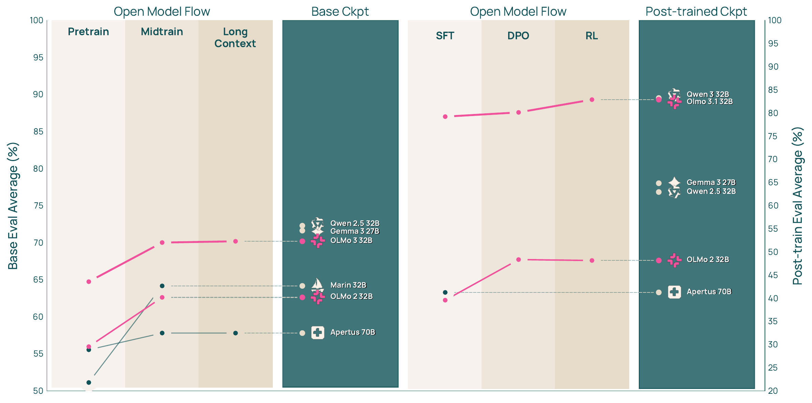

# Olmo 3 Technical Report まとめ

## 概要

Olmo 3 は、Allen Institute for AI (AI2) が開発した 7B および 32B パラメータスケールの完全オープンな言語モデルファミリーである。このリリースは、モデルの全ライフサイクル（すべてのステージ、チェックポイント、データポイント、依存関係）を含む「モデルフロー (Model Flow)」全体を公開している。

**主な特徴**:

- **完全オープン**: 学習データ、コード、中間チェックポイントをすべて公開
- **多様な能力**: 長文脈推論、関数呼び出し、コーディング、指示追従、一般的なチャット、知識リコール
- **フラッグシップモデル**: Olmo 3.1 Think 32B は、これまでに公開された最強の完全オープン思考型モデル

**モデルバリエーション**:

1. **Olmo 3 Base**: 基盤モデル（7B, 32B）
2. **Olmo 3 Think**: 段階的推論を行う思考型モデル
3. **Olmo 3 Instruct**: 簡潔で直接的な応答を生成するモデル
4. **Olmo 3 RL-Zero**: Base モデルから直接強化学習（Reinforcement Learning, RL）で訓練したモデル

**論文**: [arXiv:2512.13961](https://arxiv.org/abs/2512.13961)

## モデルフロー (Model Flow)

Olmo 3 の開発は、**Base Model Training**（基盤モデル訓練）と **Post-training**（後訓練）の 2 つの主要ステージに分かれている。Base 側は Pretraining → Midtraining → Long context の 3 段階、Post-training 側は Base からの 3 つの分岐（Think / Instruct / RL-Zero）として整理される。

{#fig-olmo3-model-flow}

## Base Model Training

### Stage 1: Pretraining

Olmo 3 Base は、**Dolma 3 Mix** と呼ばれる 5.9 兆トークンの多様なデータで事前学習される。

[→ 詳細:]{.detail-link} [Dolma 3](dolma3-dataset.qmd)

**主な革新点**:

1. **高速でスケーラブルなグローバル重複排除**: 兆トークンスケールでの新しいツール

   [→ 詳細:]{.detail-link} [重複排除](deduplication.qmd)

2. **olmOCR science PDFs**: 学術 PDF を線形化プレーンテキストに変換した新しいデータソース

   [→ 詳細:]{.detail-link} [olmOCR](olmocr-science-pdfs.qmd)

3. **データミキシングの新手法**: Token-constrained mixing と Quality-aware upsampling

   [→ 詳細:]{.detail-link} [データミキシング](data-mixing.qmd)

**データソース**:

- Web ページ
- 学術 PDF（olmOCR science PDFs）
- コードリポジトリ
- 数学データ
- その他の多様なソース

### Stage 2: Midtraining

100 億トークンの **Dolma 3 Dolmino Mix** で中間訓練を実施する。このステージの目的は、コード、数学、一般知識の質問応答（Question Answering, QA）などの重要な能力を強化することである。

[→ 詳細:]{.detail-link} [Midtraining](midtraining.qmd)

**革新的な手法**:

1. **2 部構成のフレームワーク**:
   - 個別データソースへの軽量な分散フィードバックループ
   - 候補ミックスを評価する集中統合テスト

2. **Post-training の下準備**: 指示データと思考トレースを意図的に含めることで、後訓練の基盤を構築

**評価スイート**: OlmoBaseEval

[→ 詳細:]{.detail-link} [OlmoBaseEval](olmobaseeval.qmd)

### Stage 3: Long-Context Extension

Olmo 3 は、最大 **65K トークン**のコンテキストをサポートする長文脈能力を持つ。7B モデルは 50B トークン、32B モデルは 100B トークンの **Dolma 3 Longmino Mix** で拡張訓練される。

[→ 詳細:]{.detail-link} [長文脈拡張](long-context-extension.qmd)

**主要技術**:

- **Rotary Position Embedding（RoPE）拡張**: YaRN（Yet another RoPE extensioN）を使用した位置エンコーディングの拡張
- **Document packing**: Best-fit packing で効率的な長文書の配置
- **Intra-document masking**: 同一文書内のトークンのみに attention
- **Model souping**: 複数チェックポイントの平均化

**データソースの規模**:

- 8K トークン以上: 22.3M 文書（640B トークン）
- 32K トークン以上: 4.5M 文書（380B トークン）

これは、長文脈研究のための最大のオープン利用可能なコレクションである。

### Base Model の結果

Olmo 3 Base は、32B パラメータスケールで **最強の完全オープンモデル**である：

- **完全オープンモデル**: Stanford Marin 32B、Apertus 70B を上回る
- **数学とコード**: 他の完全オープン 32B モデルに対して 2 桁の改善
- **長文脈性能**: Qwen 2.5 32B、Mistral Small 3.1 24B、Gemma 3 27B に匹敵

@fig-olmo3-flow-performance に、モデルフローの各段階で性能がどのように積み上がるかを示す。Pretrain → Midtrain → Long Context の各ステージで Base Eval が伸び、Post-training 側でも Supervised Fine-Tuning（SFT） → Direct Preference Optimization（DPO） → RL で着実に向上する。完全オープンモデル群（OLMo 2、Marin、Apertus）を大きく引き離し、Base 32B では Qwen 2.5 32B / Gemma 3 27B と同等、Post-trained 32B では Qwen 3 32B に並ぶ。

{#fig-olmo3-flow-performance}

## Post-training

Base モデルから 3 つのバリエーションを開発する。

### Olmo 3 Think: 思考型モデル

Olmo 3 Think は、最終回答を生成する前に**段階的推論**を行い、中間的な思考トレースを生成するように訓練されている。

**訓練パイプライン**:

1. **SFT (Supervised Finetuning)**: Dolci Think SFT で思考トレースを学習
2. **DPO (Direct Preference Optimization)**: Delta Learning による選好調整

   [→ 詳細:]{.detail-link} [Delta Learning](delta-learning.qmd)

3. **RLVR (Reinforcement Learning with Verifiable Rewards)**: OlmoRL による強化学習

   [→ 詳細:]{.detail-link} [OlmoRL / GRPO](olmorl-grpo.qmd)

[→ 詳細:]{.detail-link} [Dolci](dolci-dataset.qmd)

**成果**:

- **Olmo 3.1 Think 32B**: 最強の完全オープン思考型モデル
- Qwen 2.5 32B、Gemma 2/3 27B、DeepSeek R1 32B を上回る
- Qwen 3 32B に迫る性能（訓練トークン数は 6 分の 1）

**主要ベンチマーク結果** (Olmo 3.1 Think 32B):

| カテゴリ | ベンチマーク | スコア |
|---------|------------|--------|
| Math | MATH | 96.2 |
| Math | AIME 2024 | 80.6 |
| Reasoning | BigBenchHard | 88.6 |
| Reasoning | ZebraLogic | 80.1 |
| Coding | HumanEvalPlus | 91.5 |
| Coding | LiveCodeBench v3 | 83.3 |
| IF | IFEval | 93.8 |
| Knowledge | MMLU | 86.4 |

### Olmo 3 Instruct: 指示追従型モデル

Olmo 3 Instruct は、内部的な思考トレースを生成せずに、効率的で有用な応答を生成するように訓練されている。

**特徴**:

- 簡潔で直接的な応答
- 関数呼び出し（Function calling）に最適化
- 低レイテンシ（思考トレースなし）

**訓練パイプライン**:

1. **SFT**: Dolci Instruct SFT（関数呼び出しデータを含む）
2. **DPO**: 多ターン選好データと応答長の最適化
3. **RLVR**: 核心能力のさらなる改善

**成果**:

- Qwen 2.5、Gemma 3、IBM Granite 3.3、Llama 3 と同等スケールのモデルを上回る
- Qwen 3 とのパフォーマンスギャップを縮小

### Olmo 3 RL-Zero: RL from Base

Olmo 3 RL-Zero は、Base モデルから直接 RL で訓練したモデルである。

**目的**:

- 事前学習データが RL パフォーマンスに与える影響を研究可能にする
- 完全にオープンな RL ベンチマークを提供

**ドメイン**:

- Math（数学）
- Code（コーディング）
- Precise IF（精密な指示追従）
- General Mix（一般混合）

**重要性**:

- 既存のオープンウェイトモデルは事前学習データを公開していないため、RL 研究が制限されていた
- Olmo 3 RL-Zero により、データリークの影響を排除した明確なベンチマークが可能に

## 訓練コストとタイムライン

Olmo 3 Think 32B の訓練には、**1024 台の H100 GPU** を使用して約 **56 日**かかった。

**内訳**:

- **Pretraining**: 約 47 日（Midtraining と Long-Context Extension を含む）
- **Post-training**: 約 9 日（SFT、DPO、RL）

**推定コスト**: $2/H100 時間で計算すると約 **$2.75M**

## オープンアーティファクト

Olmo 3 は、すべての中間チェックポイントと最終モデルを公開している。

**公開内容**:

1. **モデル**:
   - すべてのステージの中間チェックポイント
   - 最終モデル（Base, Think, Instruct, RL-Zero）

2. **データ**:
   - **データミックス**: 実際に訓練に使用したトークン
   - **ソースデータプール**: 各ステージの完全なソースデータ
     - Pretraining: 9T トークンのクリーンデータ
     - Midtraining: 2T トークンの特化データ
     - Long-context: 640B トークンの長文書データ

3. **サンプルミックス**: より少ない計算リソースでの実験用
   - Pretraining: 150B トークン
   - Midtraining: 10B トークン

4. **コード**:
   - 訓練コード: OLMo-core（事前学習）、Open Instruct（後訓練）
   - データコード: datamap-rs、duplodocus（重複排除）、dolma3
   - 評価コード: OLMES、decon（評価データ汚染除去）

## 主な貢献

1. **完全オープンなモデルフロー**: すべてのステージ、データ、コードを公開
2. **最強の完全オープンモデル**: Base と Think の両方で最高性能
3. **新しいデータセット**: Dolma 3（事前学習）と Dolci（後訓練）
4. **新しい手法**:
   - OlmoBaseEval（効率的な Base モデル評価）
   - OlmoRL（効率的な強化学習フレームワーク）
   - Delta Learning（高品質な選好データ作成）
   - 長文脈拡張の技術（RoPE、Document packing、Intra-document masking）
5. **研究可能性**: 思考チェーンを元の訓練データまでトレース可能

## まとめ

Olmo 3 は、完全オープンな AI 研究と開発を推進するための包括的なリリースである。モデルの最終的な重みだけでなく、開発プロセス全体を透明化し、研究者がモデル開発のあらゆる段階で介入・カスタマイズできるようにしている。

**コア理念**: 真にオープンソース AI を推進するには、最終的なモデルだけでなく、そこに至る「道筋」全体を透明かつアクセス可能にする必要がある。

**フラッグシップモデル**: Olmo 3.1 Think 32B は、推論ベンチマークスイートで Qwen 3 32B に迫りながら、6 分の 1 の訓練トークン数で達成し、すべての訓練データと思考チェーンをトレース可能にしている。
